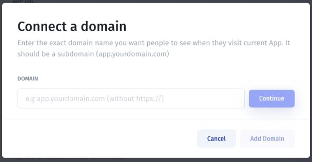
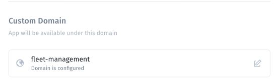

# Connect a custom domain

Connect a subdomain such as `app.example.com` to the intended app.

**Before you start:** verify the published app at its existing address and confirm that you can edit the chosen domain's DNS records.

## Open domain setup

1. Open **More → General**.
2. Find **Custom Domain**.
3. Open its configuration control. For an existing configured entry, use the edit icon.
4. In **Connect a domain**, enter the exact subdomain without `https://`.
5. Select **Continue** and follow the DNS instructions displayed for your app.
6. Review the setup and complete **Add Domain** when the required configuration is ready.

## Configure DNS using the supplied values

Record the type, host/name, and target/value shown in the setup flow. Enter those values in your DNS provider's controls, accounting for whether that provider expects a full hostname or a subdomain label.

For example, `app.example.com` identifies the intended hostname; it does not specify a universal DNS target. Use the actual target provided for your app and deployment. DNS update timing varies, so check the configured records and status rather than relying on a fixed delay.

## Verify the connection

Return to **More → General → Custom Domain** and inspect its status.

Open the exact custom address and confirm that the intended app loads. Test sign-in, relevant pages, and a permitted action using an intended account. Review identity-provider callback settings if your authentication flow depends on the app address.

If a check fails, use [Troubleshoot a custom domain](troubleshoot-a-domain.md). For self-hosted deployments, use [On-Premise custom domain configuration](../cloud-jet-bridge-and-on-premises/on-premise/.env-configuration-local-host/custom-domain-configuration-on-premise.md).
