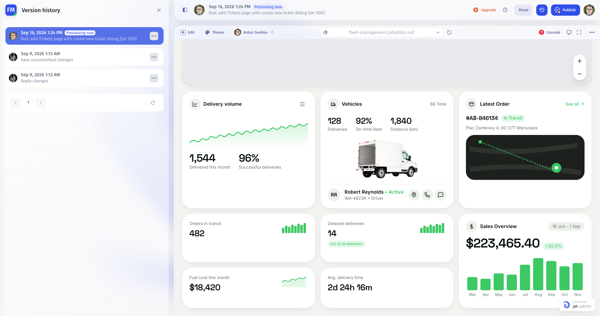

# Version History and recovery

Choose the recovery method that matches the change. App history, environment backups, and database recovery have different scopes.

| Need                                             | Start here                                                                              |
| ------------------------------------------------ | --------------------------------------------------------------------------------------- |
| Inspect or preview recorded app changes          | [Version History](../../ai-app-builder/test-and-publish/version-history.md)             |
| Return to a recorded app state                   | Version History → the selected version's menu → Revert version                          |
| Download or restore an environment configuration | [Environment settings](../environments/)                                                |
| Transfer a backup between Cloud and On-Premise   | [Cross-Instance Backup & Restore](version-control/cross-instance-backup-and-restore.md) |
| Use the earlier snapshot/release interface       | [Version Control](version-control/)                                                     |
| Recover records or external effects              | The affected database, API, or workflow's recovery process                              |

## Review a version before reverting

Open the history icon beside **Publish**, select an entry, and use **Preview version** or **Show changes**. Confirm the version label and review the affected behavior before choosing **Revert version**.

Follow the canonical [Version History guide](../../ai-app-builder/test-and-publish/version-history.md) for the complete workflow.

## Prepare an environment backup

Open the app menu, select the gear beside the intended environment, and use **Download backup**. Record the app, environment, date, and platform version with the file.

Before using **Restore backup**, verify the target environment and the backup you intend to apply. Review the configuration and rerun [release checks](../publish-your-app/verify-a-release.md) afterwards.

App or environment restoration does not establish that connected records or external workflow effects were reversed. Identify those systems separately and confirm their recovery scope.

## Keep a release record

Record the approved app version, environment, platform version, backup location, and verification results. Use that record to compare the last working state with an incident, and repeat affected permission and data tests after recovery.
