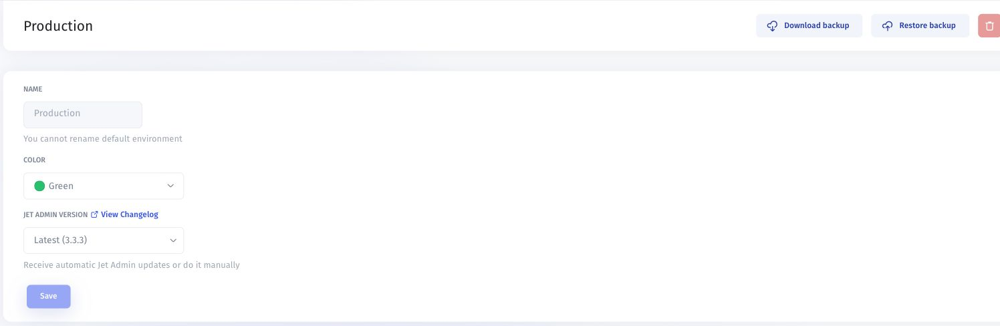

# Environments

Use environments to manage separate configurations for development, staging, and production. Before testing changes, verify which database or API each environment uses: a separate app configuration does not by itself guarantee separate data.

## Open or switch environments

1. Open the app menu from the app icon in the **top-left corner** of the builder.
2. Find the **Environments** list.
3. Select the environment you want to work in.
4. To open its settings, select the **gear icon** beside its name.

Confirm the selected environment before changing settings, restoring a backup, or running actions that write data.

## Create a staging environment

1. Open the app menu and select **Add new Environment**.
2. In **Create an Environment**, enter an **Environment Name**, such as Staging.
3. Choose a **Color** that distinguishes it from Production.
4. Select **Create**.
5. Review the new environment's resource connections and access before testing.

Use staging databases or APIs and synthetic test records where appropriate. Check credentials, workflows, and external actions so a staging test does not write to a production system unintentionally.

## Configure an environment

Open the environment's gear menu to find its settings.

| Control           | Purpose                                                                            |
| ----------------- | ---------------------------------------------------------------------------------- |
| Name              | Identifies the environment. The default Production environment cannot be renamed.  |
| Color             | Provides a visual cue for the environment.                                         |
| Jet Admin Version | Selects automatic updates through Latest or a specific available platform version. |
| View Changelog    | Opens release information to review before updating.                               |
| Save              | Applies the settings you changed.                                                  |
| Download backup   | Starts the environment backup download.                                            |
| Restore backup    | Starts the backup restoration flow for the selected environment.                   |

The version number shown beside **Latest** is an example from the captured screen; use the values available in your app.

## Scenario: test a platform update before Production

1. Open the **Staging** environment's settings.
2. Review **View Changelog**.
3. Under **Jet Admin Version**, choose **Latest** for automatic updates or a specific available version for a controlled test.
4. Select **Save**.
5. Test important pages, integrations, workflows, and user permissions against the staging resources.
6. After approval, open **Production** settings, select the tested platform version, and save.
7. Repeat the critical checks in Production.

To keep Production on a reviewed platform version, select a specific available version instead of Latest. Before a major upgrade, check compatibility and recovery requirements in [Update to a new version](../version-migration.md).

## Download and restore a backup

Before a significant configuration change, open the intended environment's settings and select **Download backup**. Store the file with the app name, environment, date, and platform version so you can identify it later.

To restore, open the **target environment's** settings, select **Restore backup**, and follow the file-selection and confirmation flow. Review the target and backup before completing the operation, then test the resulting configuration.

Treat backup restoration as a change to the target environment. Do not assume it restores records in connected databases or reverses external workflow actions. For transfers between Cloud and On-Premise, see [Cross-Instance Backup & Restore](../version-control/cross-instance-backup-and-restore.md).

## Environments, app versions, and publishing

* **Environment settings** control the selected configuration and Jet Admin platform version.
* [**Version History**](../../../ai-app-builder/test-and-publish/version-history.md) lets you inspect, preview, and revert recorded app changes.
* **Publishing** is the release step for the app your users access.

Changing the Jet Admin Version selector is different from selecting an app version in Version History.

For configuration transfer, see [Merge Environments: Jet Tables and Custom Components](merge-environments-jet-tables-and-custom-components.md). Review the source, target, resources, and merge scope before applying changes.

## Earlier interface walkthrough

This existing video shows an earlier environment-management interface. Use the current navigation and controls described above.


