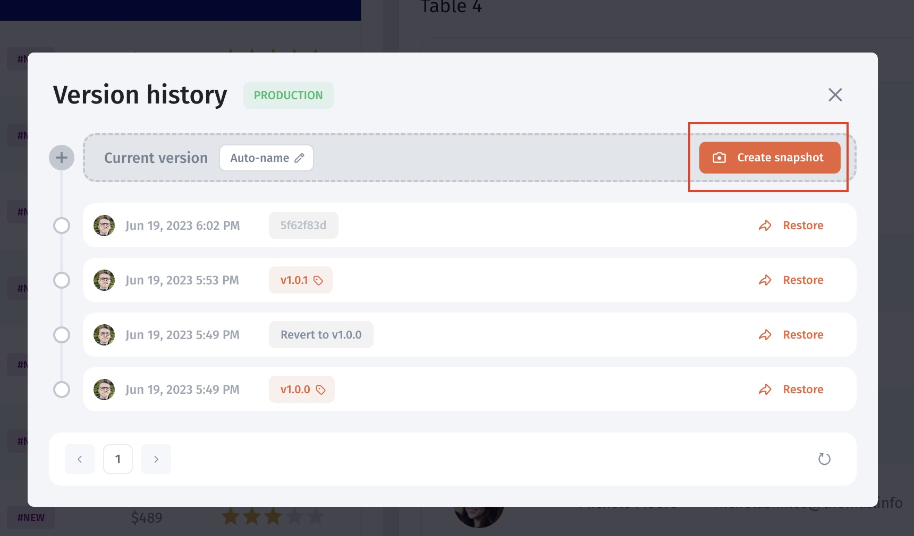
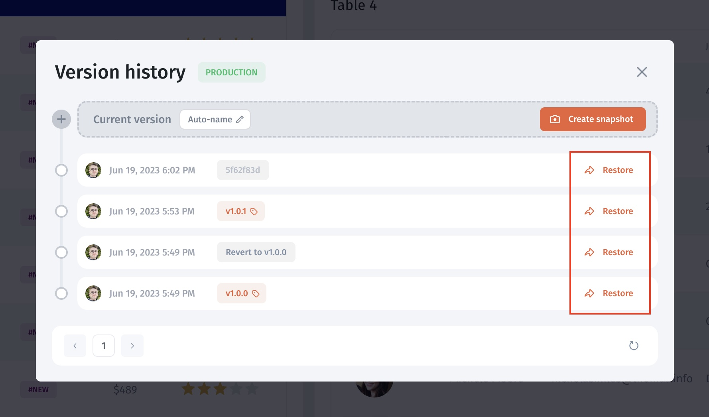

# Version Control

This guide describes the earlier snapshot and release interface. For the current AI App Builder panel with **Preview version**, **Revert version**, and **Show changes**, see [Version History](../../../ai-app-builder/test-and-publish/version-history.md).

Working changes, saved snapshots, and the published app are different states. Confirm the release behavior of your app's builder before making a change. Do not assume an editor save immediately publishes to users.

Use a named snapshot to identify the app configuration being reviewed. Test the intended release before publishing, then verify its actual app URL with a representative user. A snapshot does not guarantee disruption-free deployment.

The older interface below provides a release/snapshot list. Its screenshots are retained for Classic apps that expose these controls; they do not establish the history retention or coverage of your current deployment.

<figure><figcaption></figcaption></figure>

### Releases


Check the release controls and entitlement available to your app. This historical guide does not establish current plan eligibility.


Before selecting a snapshot, confirm the app and environment. Creating a snapshot records a point to review; use the publication controls available in your interface to make a reviewed release available to users.

1. Click on Version History on the right-top bar

<figure><figcaption></figcaption></figure>

2. Check the list of releases/snapshots. You can do the following actions:

* Create a new release
* Revert changes
* Set up a release name

<figure><figcaption></figcaption></figure>

### Create a new release

Click **Create snapshot** to create a version for release. You can also specify a release name or auto-generate it.

<figure><figcaption></figcaption></figure>

### Revert changes

In the older snapshot interface, select a historical point and inspect the **Restore** action. Before applying it, record the current configuration and confirm the restore scope. Restoring app configuration is not a guarantee that database writes, messages, or other external effects will be reversed.

<figure><figcaption></figcaption></figure>

The earlier interface can display a **Reverted changes** entry. After restoring, inspect the available history and repeat page, data-action, and permission checks. Verify the live app separately before treating recovery as complete.

### Creating a backup version


Confirm backup coverage, scheduling, and retention for your deployment. A manually downloaded configuration backup does not establish that connected records and files are included.


To save a stable version, open your app in the builder mode and click on the "App" icon in the top left corner

<figure><figcaption></figcaption></figure>

Then choose the environment you want to save the version from (click the gear icon to drill down)

<figure><figcaption></figcaption></figure>

After that, you can **download the current configuration** and store it in your local storage

<figure><figcaption></figcaption></figure>

### Restoring a previous version

For the earlier upload-based restore interface, choose the intended backup file only after confirming the target environment and compatibility. Review the restored configuration, resource connections, data actions, and user permissions. Use [Environments](../../environments/) for the current Download backup and Restore backup entry points.

<figure><figcaption></figcaption></figure>

## Recovery acceptance checks

* Confirm the intended version and environment.
* Verify a representative page and a read-only data query.
* Check allowed and denied access with test identities.
* Compare connected records and files independently of app configuration.
* Confirm the app address used by end users shows the intended state.

The procedures and retained media in this legacy reference were editorially reviewed; a restore was not performed during this update.
