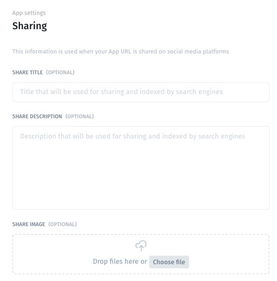

# Set the social sharing preview

Set the metadata used when your app URL is shared on social media.

## Configure the preview

1. Open **More → Sharing**.
2. Enter an optional **Share Title** that identifies the app.
3. Enter an optional **Share Description** explaining its purpose.
4. Under **Share Image**, drop an image or select **Choose file**.
5. Reopen the settings to confirm the values persisted, then check the preview of the published URL on the intended platform.

Use an image and text suitable for the audience that may see the shared address. Avoid including private records in the preview.

## Verify the result

Check the title, description, image crop, and destination address. If an old preview remains, confirm the saved settings and the exact URL, then use the receiving platform's available preview-refresh tools.

These settings describe the app when its URL is shared; they do not invite users or grant access. For membership, use the top-toolbar **Share** button and [Share with the intended audience](share-your-app.md).
