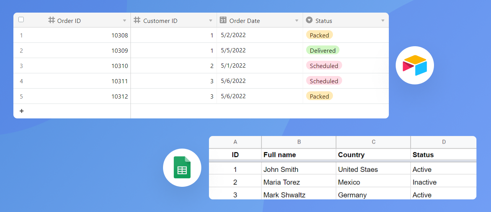
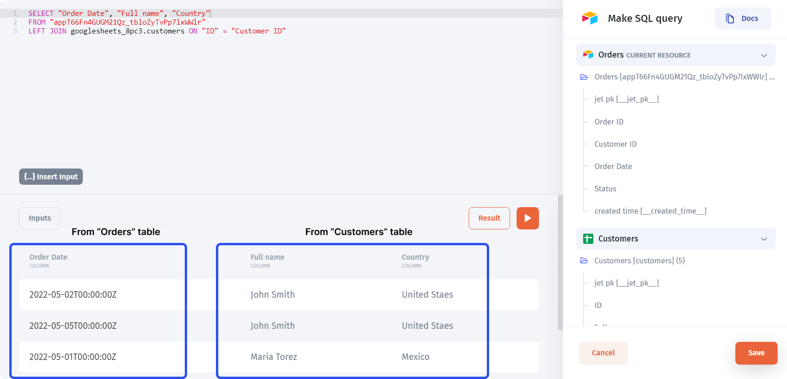

# Blending the Data

To demonstrate how the data blending works, we'll use two data sources: Airtable and Google Sheets, where the former contains the `Order` table and the latter - the `Customers` table. Notice that the `Customer ID` column in the `Orders` table refers to the `ID` in the `Customers` table.

Once you've connected your data sources (read more on particular integrations [**here**](../integrations/)), proceed to the data section and pick a data source where you want to perform the blending _(you can choose either one, it's just a matter of convenience)_

1. Create a new **Virtual Collection**
2. Name the Collection
3. Click on the `Create` button
4. You'll see all the data sources you've connected using "Sync" on the right. You can now pick the columns and use them in your query:



And after writing and running our query, we get the resulting table, containing `Full name` and `Country` columns from the `Customers` table together with the `Order Date` column from the `Orders` table.

After saving changes, we get a collection with joined data that we can later use in the interface.
