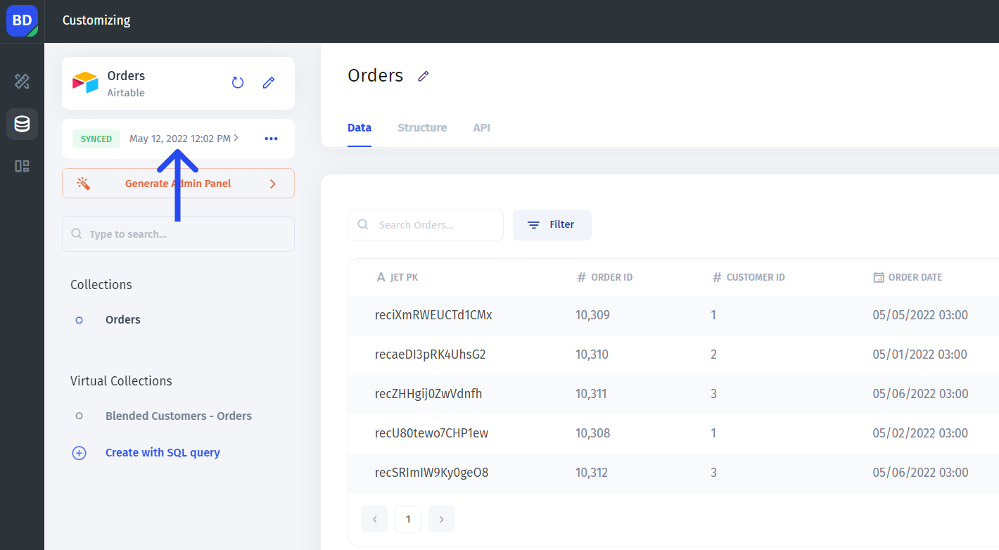
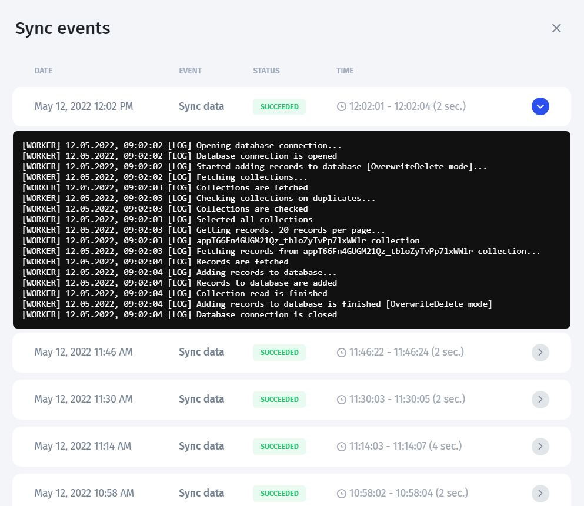

# Sync Options

The sync parameters can be changed in the **Sync options** tab. To get there, click the three dots in the top left corner of your data source page:



The syncing consists of two parts: the `Data source` - `Jet tables` connection (referred to as **External updates**) and the `Jet tables` - `Interface` connection (referred to as **Internal updates**). The latter pair is syncing in real-time while the former one's syncing interval can be changed


At the moment, the external updates interval can only be set on the side of Jet Admin, so if you need to change it, reach out to client support


In the sync tab, you can:

* View the **status** (could be <mark style="color:green;">active</mark> or <mark style="color:yellow;">paused</mark>) (1)
* Control the sync: **pause it** or perform a **manual sync** - Sync now (2)
* View the **Internal updates interval** (3)
* View the **external updates interval** (4)

The last **sync date and time** are displayed along with the sync status:

You can further investigate the **syncing logs** and **console** by clicking on that time:

To learn more about using SQL queries in Jet Admin, please refer to this page:


[reading-data-from-sql.md](../../getting-started/part-2-intermediate/reading-data-from-sql.md)

