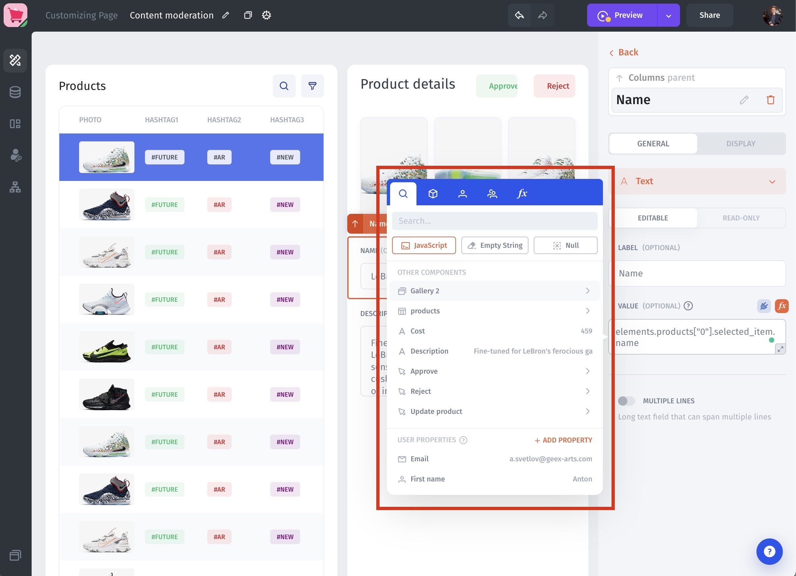
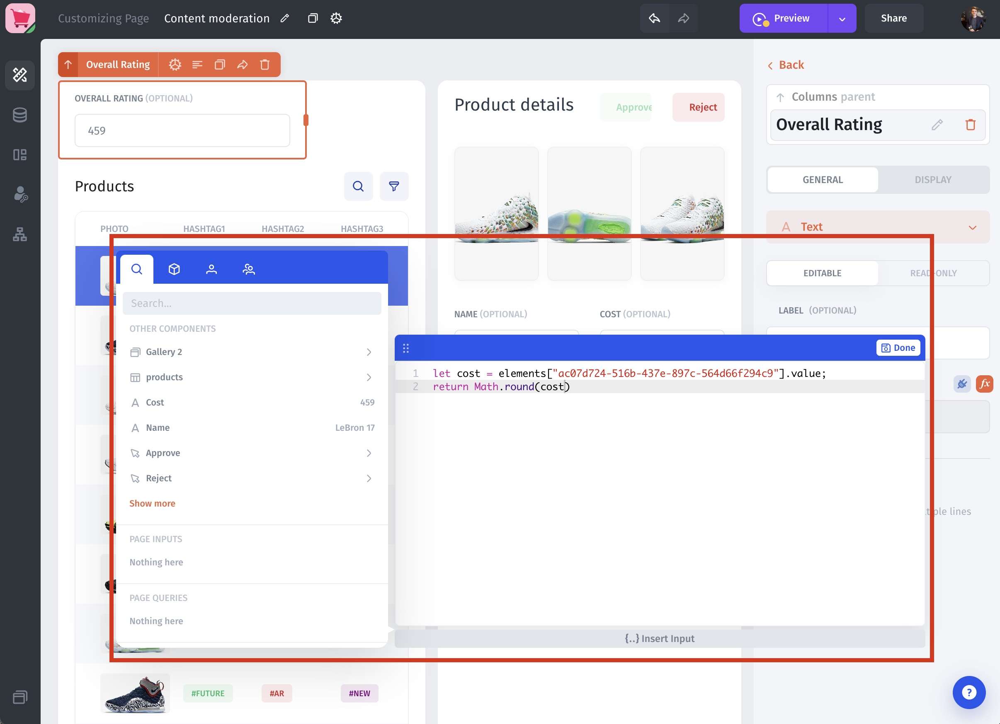
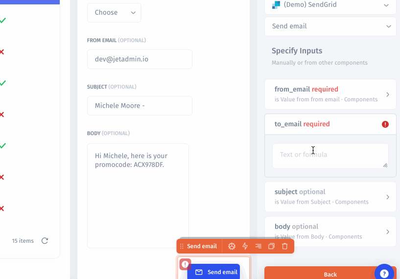

# Extract & Pass Values

<figure><figcaption></figcaption></figure>

Jet allows you to extract values from **`Visual Builder`**, **`Data`**, and **`Workflow`**. There are the following Values Types:

* Visual Builder/Data/Workflow Values

<figure><figcaption></figcaption></figure>

* User and Team Values (Email, First and Last name, token, user id, )

<figure><figcaption></figcaption></figure>

* Computed Values (Transform your values with Formula or JavaScript)

<figure><figcaption></figcaption></figure>


[formulas](../computed-columns/formulas/)


<figure><figcaption></figcaption></figure>


[javascript-column.md](../computed-columns/javascript-column.md)


## Visual Builder Values

There are two types of Visual Builder values: Component and Page values

### Component Values

Using Component Values you can pass values such as subject and body to `Send email`, filter a list, or pass data from one page to another. You can specify Values for each [page](../design-and-structure/pages.md) or [component](../design-and-structure/components/). Here we guide you through Values types and how to specify Values for a page or component.

### Page Values

In the case where you want to create a Detail page with information about the user on that page: name, last name, address, etc. You need to pass the parameter values of these fields from one page to another. To do this, you need to create parameters for this page and pass these parameters to another page using the [Navigate to Page](../design-and-structure/actions.md) action.

#### Create Page Values

To create Page Values go to the page settings then click **+Add Parameter.**

#### Link pages

In order to pass a value from one page to another, you need to use the Navigate to page action.


[column-values.md](../design-and-structure/column-values.md)



[formulas](../computed-columns/formulas/)


