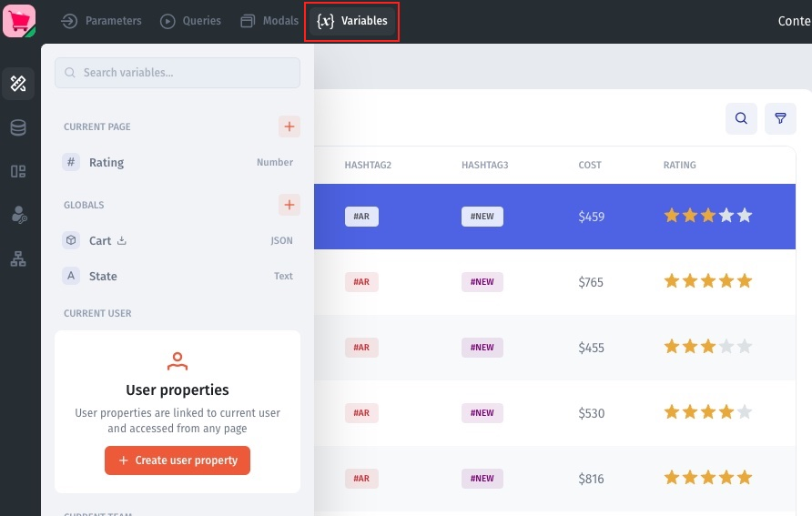
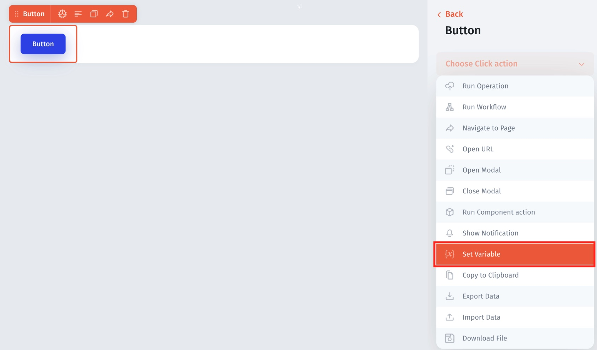

# 🔠 Variables



In Jet, users can create two types of variables using State Variables:&#x20;

* **Temporary** – for the user session, reset on refresh.
* **Local Storage** – stored in the browser across sessions and pages.

Temporary variables are session-based and are reset when the user refreshes the page, while Local Storage variables are stored in the browser and persist across sessions. Local Storage variables utilize the browser's Storage interface to read and write client-side data.

Builders can use these variables to store local states in their applications, allowing for caching and reusing intermediate states across different APIs and components.

To access the context menu for State Variables, users can find it in the Variables menu, which can be accessed by hovering over the Variables icon on the left-hand side of the App Builder.

<figure><figcaption></figcaption></figure>

### **Create a variable**

Depending on how you plan to use your variable, you can choose whether to make your variable **temporary** – only available for the current user session – or **stored** – to be used across browser sessions.

**Scope**

* **Global –** variables that can be accessed from anywhere in your app across pages&#x20;
* **Page** – variables that can be accessed from _only_ a specific page
* **Current User** – variables that only a specific user only get access
* **Current Team** – variables that only specific teams only get access

To create new variables, click on plus icon under the scope that you would like to use:

* **Type (text, boolean, date, etc.)**:
  * You can also choose a display format, for example, if you want to display a currency symbol if your variable is for money or if you want to display a percent sign if your variable is a percent.
* **Default value**:  (Optional) set a default value for your variable.
* **Save to local storage / temporary**: `Temporary State Variable, Local Storage State Variable`

<figure><figcaption></figcaption></figure>

<figure><figcaption></figcaption></figure>

### **Set a Variable**

To set up a specific value for a Variable go to Action and choose **Set Variable**

<figure><figcaption></figcaption></figure>

<figure><figcaption></figcaption></figure>

###

### **Deleting, editing, or making variables stored/temporary**

If you click on the button with the three dots next to the variable you want to change, a dropdown menu will appear that allows you to delete, edit, or change the variable from temporary to stored and vice versa.

<figure><figcaption></figcaption></figure>

### **Reference a variable**

You can easily reference a variable by finding or searching for it in the _ƒx formula_ menu.

<figure><figcaption></figcaption></figure>
