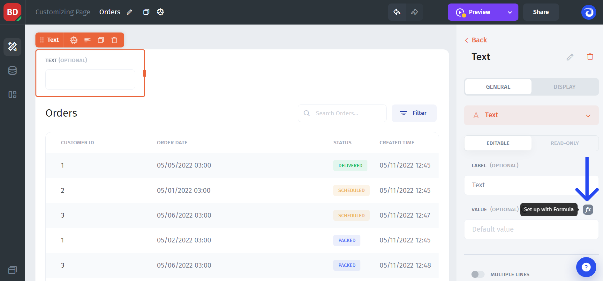
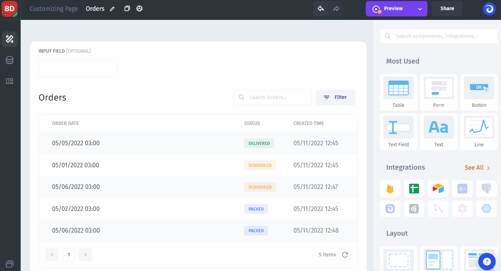
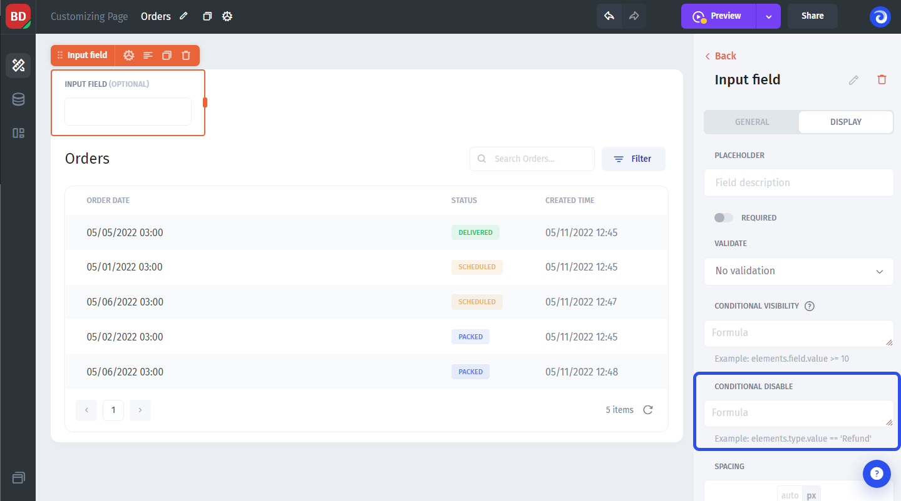

# ℹ Conditionals

Jet Admin allows you to use conditional logic in your app and apply it to UI components and dynamic values. There are several ways to implement it:

### Formulas

You can use logical expressions, such as `If`, `Else`, `Or` to transform dynamic values. These logical expressions live in Jet in the form of **Formulas**, that can be found in the Dynamic data modal pop-up:

### Conditional visibility&#x20;

Component visibility allows you to **show or hide UI components** based on a rule. This might be useful, for example, when building a complex form where based on a certain input, you want or don't want to show more fields to gather additional information.

Or when you want to show or hide some sections of your app depending on the user who's logged in or their role.

Conditional visibility **can be accessed** within any UI component by proceeding to the Display tab:


[conditional-visibility.md](conditional-visibility.md)


### Conditional disable

But what if you want to still show the value of a UI component, but make it **uneditable based on a rule**? In that case, you should use the conditional disable feature, which you can find right below the Conditional visibility:

Allowing users to add, edit & delete records can be very powerful, but sometimes you want to restrict this to only certain Pages or to certain Teams/Users. With conditional add, edit & delete you can do this.


[conditional-add-edit-and-delete.md](conditional-add-edit-and-delete.md)


