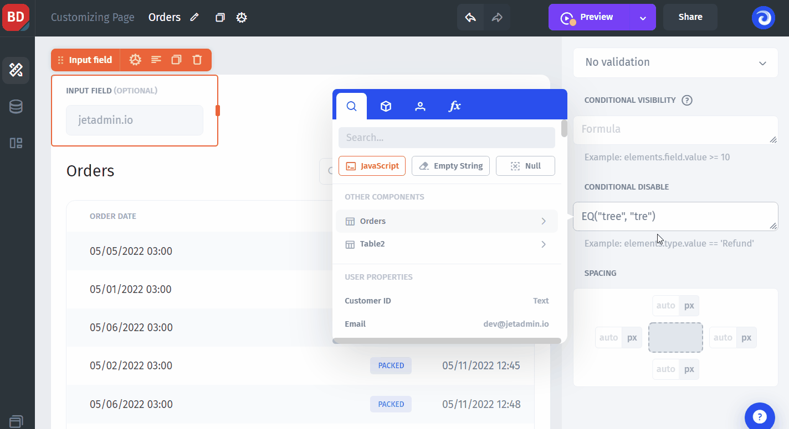
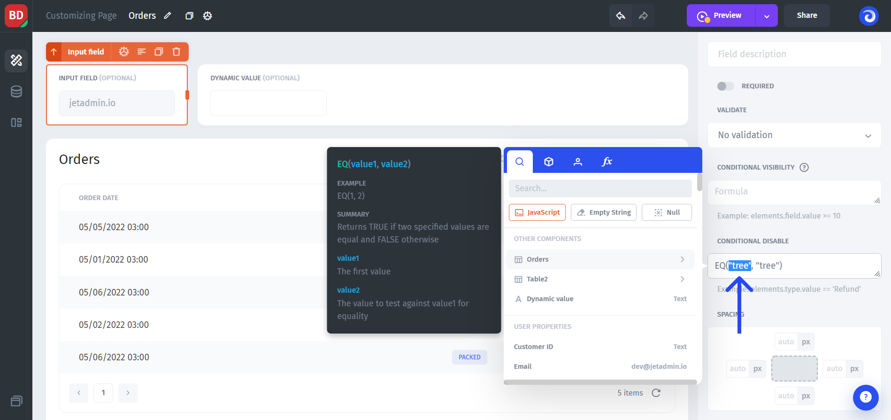
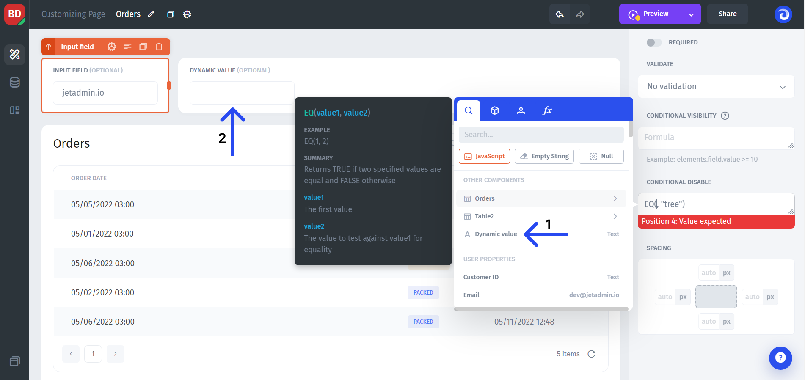
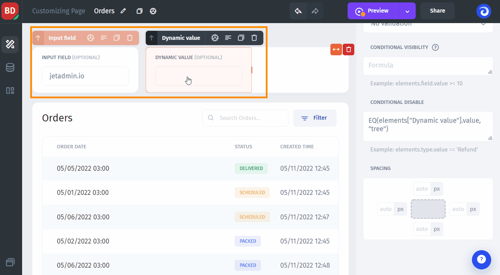

# Conditional Disable

Conditional Disable allows you to show the value of the field (input) but make it **dynamically uneditable** based on a rule.&#x20;

To enable it, you'll have to write a formula in the "Conditional disable" box.


**You don't have to** write an "IF" expression to make it work. Simply `EQ(A, B)`will make the field disabled (uneditable) for when the variables meet the condition (A=B) and enabled (editable) when the opposite is true (under the hood it will return logical "1" and "0" correspondingly)


Here's an example of a conditional disable for static values:

**Static values** are great for demonstrating how conditional disable works, but the real use-cases most of the time involve **dynamic values**.

To use a **dynamic value**, delete one of the values in the formula (doesn't matter which one):&#x20;

And replace it with the reference to the dynamic value. In our example, we've added to a canvas a new UI component: `Dynamic value` input **(2)** that may receive any value. After we've added it, it automatically appears in the modal window where we can reference it **(1)**.


Learn more about **binding and referencing** dynamic values in the [Values section](../parameters/)


After mapping the variable from the "Conditional disable" formula onto the "Dynamic value" input component, the left component will be editable/non-editable **based on the value** in the right input component:

Not only can you fetch dynamic values from the "Input" UI components, but also "**User properties**" such as `email`, or values from specific fields from **selected rows** in the "Table" UI component.
