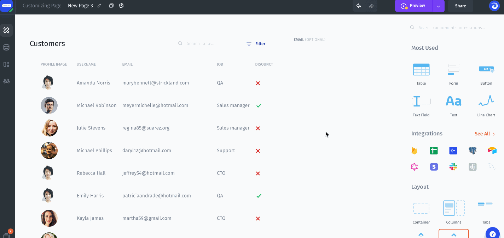

# Conditional Visibility

Conditional Visibility allows you to **dynamically show/hide** a UI component based on a rule.&#x20;

To enable it, you'll have to write a formula in the "Conditional visibility" box.


**You don't have to** write an "IF" expression to make it work. Simply `EQ(A, B)`will make the field visible when the variables meet the condition (A=B) and invisible when the opposite is true (under the hood it will return logical "1" and "0" correspondingly)


If the conditional visibility was enabled for a specific UI component AND the condition **is not** met, you'll see **the "eye" sign** in front of the component:

Here's an example of how conditional visibility works with static values:

**Static values** are more suited for demonstrating how conditional visibility works when the real use-cases most of the time involve **dynamic values**.

To use a **dynamic value**, delete one of the values in the formula (doesn't matter which one):&#x20;

And replace it with the reference to the dynamic value. In our example, we've added to a canvas a new UI component: `Dynamic value` input **(1)** that may receive any value. After we've added it, it automatically appears in the modal window where we can reference it **(2)**.


Learn more about **binding and referencing** dynamic values in the [Values section](../parameters/)


.png>)

After mapping the variable from the "Conditional visibility" formula onto the "Dynamic value" input component, the left component will be visible/invisible **based on the value** in the right input component:

Not only can you fetch dynamic values from the "Input" UI components, but also "**User properties**" such as `email`, or values from specific fields from **selected rows** in the "Table" UI component.

There are a few **examples** of how conditional visibility can be used:

### Example 1: Hiding a component until a row is selected

For instance, you need to hide a component until a row is selected in a table. To do this, you need to do the following:

The value of the Visible field in this case will be as follows:

`=elements.Customers["0"].selected_item.email`


The Email field will now be hidden as long as no row is selected in the table.


### Example 2: Hiding a component until a row with a certain value is selected

As an example, you need to hide a component until the value in a certain field is equal to a certain value. Let's consider the same example, will hide the Email field until a user with Active status is selected in the table. To do this, we will use the EQ() function to compare the two values:

The value of the Visible field in this case will be as follows:

`=EQ(elements.Customers["0"].selected_item.status, "active")`


The Email field will be hidden until a user with Active status is selected in the table.


### Example 3: Hiding a component if the value is greater than or less than a certain value

Now let's look at an example of component visibility using basic compare operators (such as > or <). Suppose you want to hide the button if the value in the Quantity field is less than 1:

The value of the Visible field in this case will be as follows:

`=elements.Quantity.value >= 1`


Now the button will be hidden if the Quantity field is less than 1.


### Example 4: Hiding a component if the Page Value, User or Team Property value is equal to a certain value

Now let's look at an example of hiding a component depending on values such as Page Values, User & Team Properties and implement the condition of hiding a component if User Property has a readonly value. To do this, you first need to create a User Property, see [here](../security-and-privacy/user-and-team-properties.md) for details.

For this purpose, I set the User Property Access for my user with the value readonly.

The value of the Visible field in this case will be as follows:

`=IF(EQ(user_properties.Access, "readonly"))`


Now the button will be hidden for all users who have a read-only Access property value.


### Example 5: Hiding a component depending on several conditions

Now let's implement a more complex scenario of hiding a component depending on several conditions. Let's consider the simple variant of hiding the button until the two fields Active and Subscribed are true.

The value of the Visible field in this case will be as follows:

`=AND(elements.Active.value, elements.Quantity.value)`


Now the button will be hidden until both values are true.



Note that you can do the same for dynamic values passed from other components, as in the examples above.

