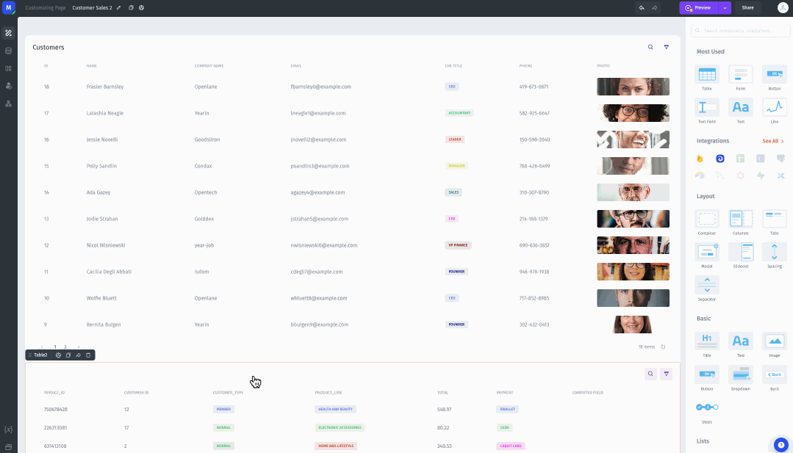
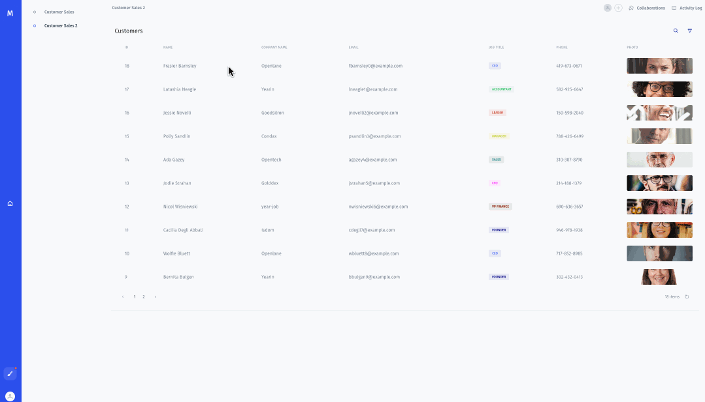

# Hiding a component until a row is selected

If, for example, you need to hide a component until a row is selected in a table, you need to do the following:

1. Select the component that you want to add conditional visibility to. In this example, that component is a table that displays all the purchases made by the selected customer.
2. In the component menu, go to the _Display_ section.
3. Click in the _Conditional Visibility_ field, and choose the condition that you want to use, or use a formula. In this example, I'm choosing my _Customers_ table and then _Selected Row_. This way, when my user clicks on a customer, a table will appear below the first one that shows all the purchases made by that customer. Note that I click on the _Apply_ button next to _Selected Row_ – this is because I don't want a specific value from that row.&#x20;

You do not have to enter it manually, but the value of the Conditional Visibilty field in this case will be&#x20;

`=elements.Customers["0"].selected_item`


The table will now be hidden as long as no row is selected in the table.


App Builder view:

<figure><figcaption></figcaption></figure>

App view:

<figure><figcaption></figcaption></figure>
