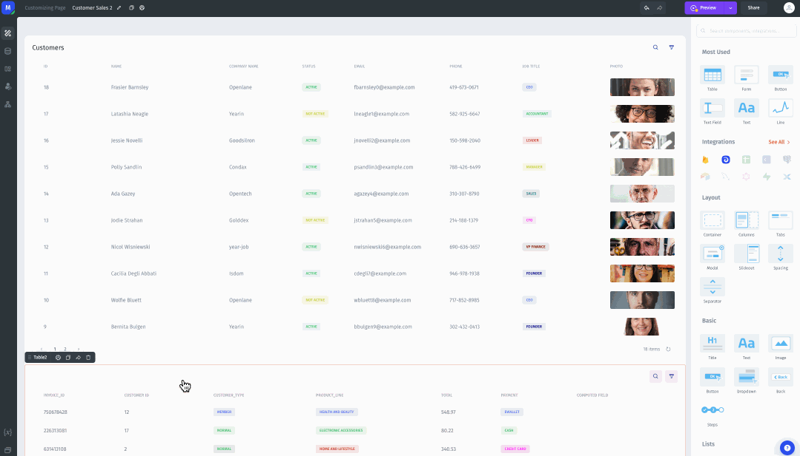
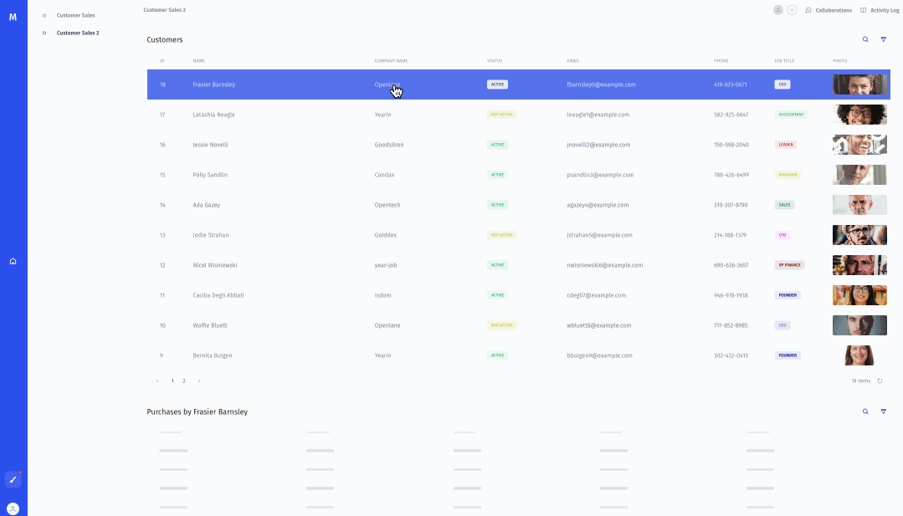

# Hiding a component until a row with a certain value is selected

As an example, you need to hide a component until the value in a certain field is equal to a certain value. Let's consider the same example, will hide the table with purchase info until a user with Active status is selected in the _Customers_ table. To do this, we will use the EQ() function to compare two values:

1. Select the component that you want to add conditional visibility to. In this example, that component is a table that displays all the purchases made by the selected customer.
2. In the component menu, go to the _Display_ section.
3. Click in the _Conditional Visibility_ field, and choose the condition that you want to use, or use a formula.\
   \
   In this example, I'm using the EQ() function to compare the value _Status_ in the selected row to the value "active".\
   \
   To do this, I first write or choose the formula `EQ(),`  and then I enter my values. For the first value, I choose my _Customers_ table, then _Selected Row,_ and then the _Status_ field. For the second value, I simply write "active". \
   \
   In the end, the value in the _Conditional Visibility_ field will be:\
   `=EQ(elements.Customers["0"].selected_item.status, "active")`\
   \
   With this formula set up, the table that displays purchases will only display if the selected customer has a status of _Active._&#x20;

App builder view:

<figure><figcaption></figcaption></figure>


The Email field will be hidden until a user with Active status is selected in the table.


App view:

<figure><figcaption></figcaption></figure>
