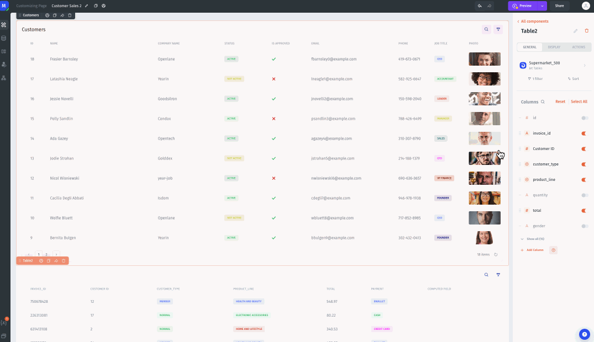

# Hiding a component using multiple conditions

Sometimes you may want to use multiple conditions when setting conditional visibility for a component. An easy way to do this is to use logical operator formulas like `AND()`, `OR()`, and `NOT()`.

In this example, I will use `AND()` to make my purchases table visible _only_ when the selected customer has a status of _Active_ and true for _Is Approved._ If either of these conditions is not met, the purchases table will not be visible.

1. To set up conditional visibility using multiple conditions, start the same way as in other examples – click on the component you wish to make conditionally visible, then go to the _Display_ section in the component menu.&#x20;
2. In the _Conditional Visibility_ field, first choose the logical operator formula that you want to use. In this example, that will be `AND()`.
3. Next, enter the conditions that you want to use with the logical operator.\
   \
   In this example, _Is Approved_ is a checkbox – so it will already return _True_ or _False_ – but _Status_ is a text field, so I will need to use the `EQ()` formula to return _True_ or _False._&#x63;hoose the user property that you want to use. Because my property type is a checkbox, it already returns `True` or `False` based on its value.&#x20;

When I have set this up correctly, the value in the _Conditional Visibility_ field will be:\
\
`=AND(elements.Customers["0"].selected_item["Is Approved"], EQ(elements.Customers["0"].selected_item.status, "Active"))`


Now the purchases table will only appear when a user is selected  who is approved and also _Active._


App builder view:

<figure><figcaption></figcaption></figure>

App view:

<figure><figcaption></figcaption></figure>
