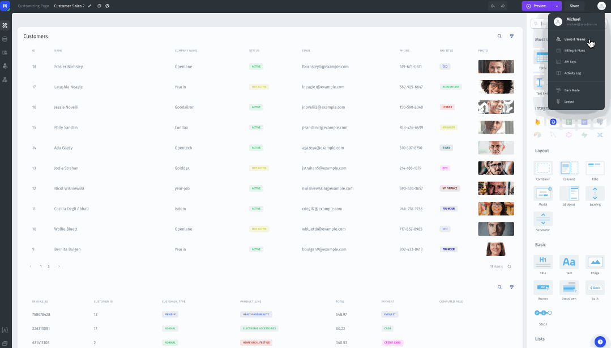
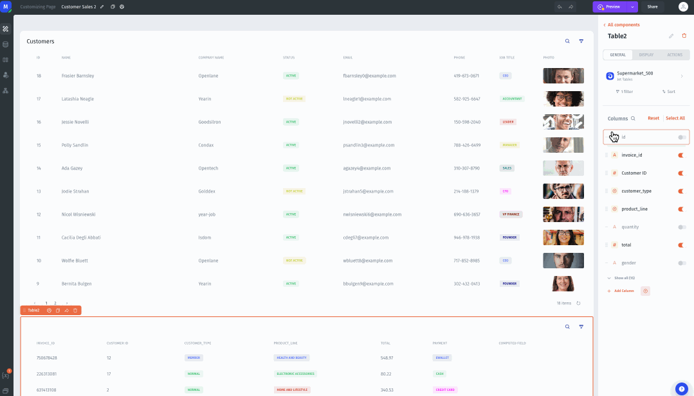
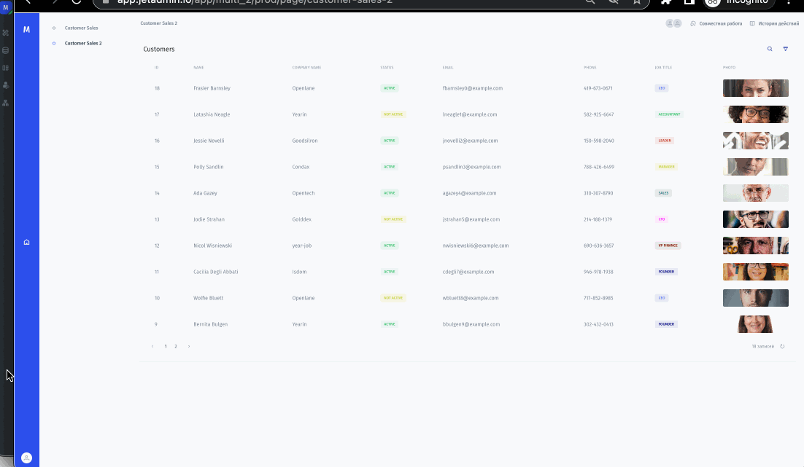

# Hiding a component using the Page Value, User, or Team Property value

A common use case for visibility settings is to make certain components visible to specific teams or kinds of users.&#x20;

To implement this kind of conditional visibility, you will need to have a Property Value set up. In this example, I am going to set up the property value _Onboarded_. I can do that by going to the _Users_ menu, which can be accessed either in the left hand menu in the resources section, or in the account menu in the upper right hand corner.

<figure><figcaption></figcaption></figure>

1. To set up conditional visibility based on this property, start the same way as in other examples – click on the component you wish to make conditionally visible, then go to the _Display_ section in the component menu.&#x20;
2. In the _Conditional Visibility_ field, choose the user property that you want to use. Because my property type is a checkbox, it already returns `True` or `False` based on its value. \
   \
   If you were using a property that had text elements or something else, for example with the values "Junior," "Middle," and "Senior," you might need to use a formula like `EQ()` to get the result you want. For more information about using such a formula, see the previous example about setting visibility based on a specific value.


Now the button will be hidden for all users who have _False_ for the _Onboarded_ property value.


App Builder view:

<figure><figcaption></figcaption></figure>

App view:

<figure><figcaption></figcaption></figure>
