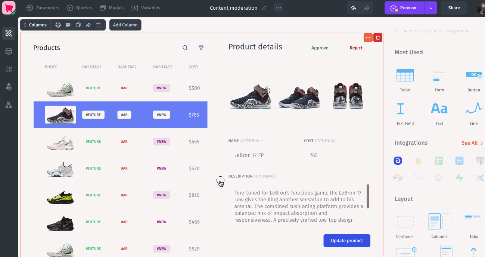
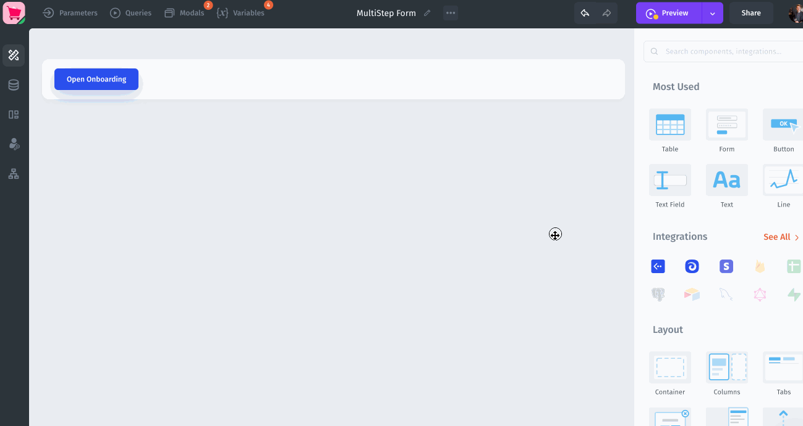
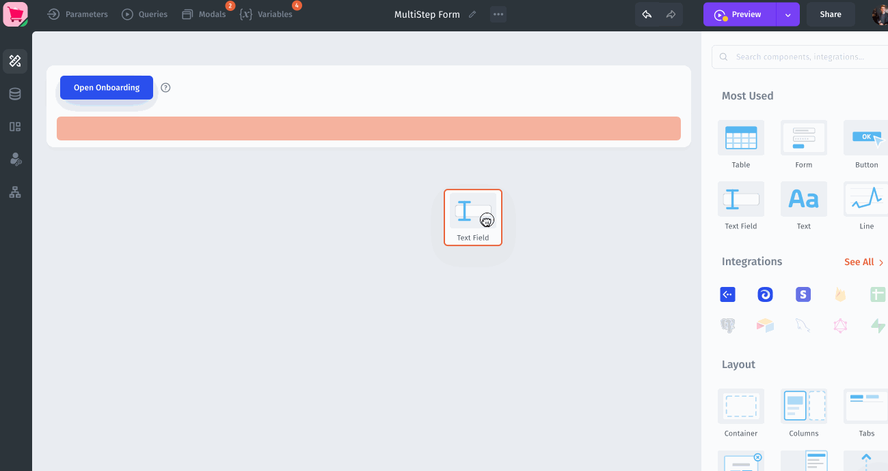
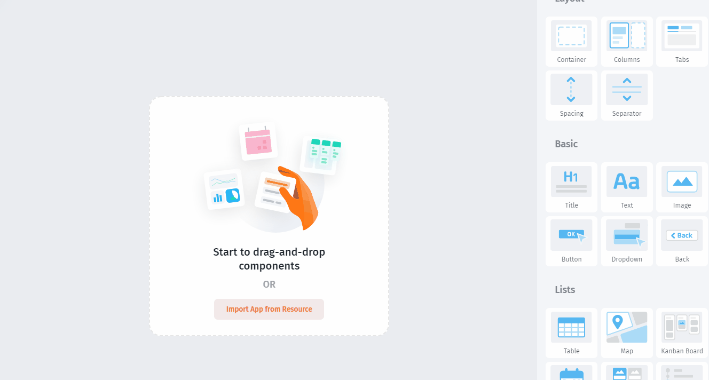
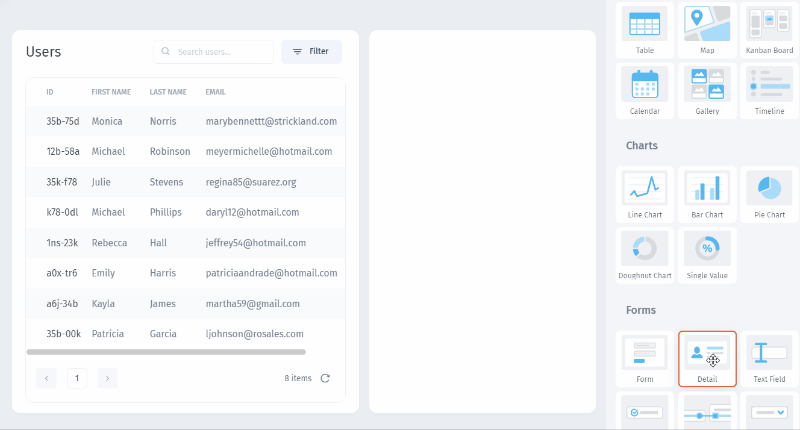
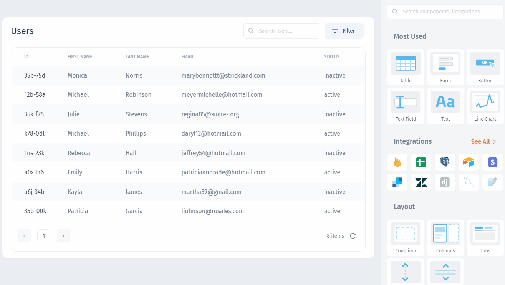
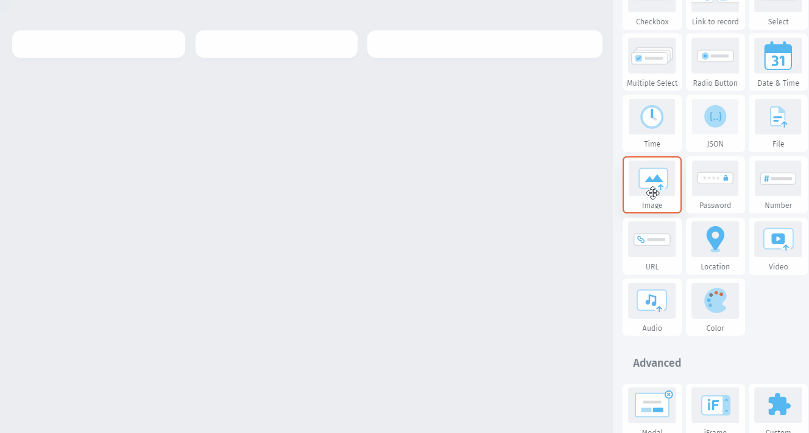
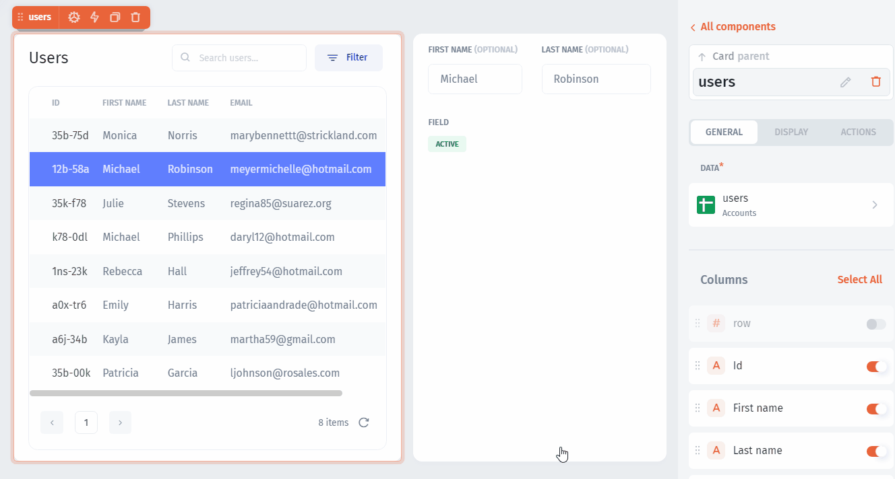

# Components

## Table Editing 

Enable users to edit records simply by clicking on a cell in a table. You can even specify which fields you want to make editable. Add table editing to your app for a smoother, intuitive user experience.

<figure><figcaption></figcaption></figure>

## Tooltips 

Add tooltips to your app components to help new users! Custom tooltips are an unobstrusive way to provide necessary information about how your app functions.

<figure><figcaption></figcaption></figure>

## _On Change_ Field Action 

Set actions that trigger when a field is updated. This can be great for showing notifications, for quickly setting variables used elsewhere in your app, and for other things as needed.

<figure><figcaption></figcaption></figure>

### Setting the Layout

**Layout** components allow you to assemble other components on the page. We recommend starting with the `columns` component - just drag-and-drop it on the page:

### Adding Components

You can add any component by simply drag-and-droping it onto the page:

### Configuring Components

Different components have different settings, which you can access on the right of the window after clicking on the component once. Depending on the component, the menu will have the tabs **General**, **Display**, and **Actions.**

**General:** Contains options for configuring the way the component works. For example: which fields should be included in a table or which datasets to use in a chart.

**Display:** Has display options. For example: **Conditional Visibility**, **Tooltips**, **Component Title**, **Enable Editing** for tables, and whether a field is **Required**.&#x20;

**Actions:** Contains settings for triggering actions based on user interaction with the component. For example: Triggering actions when button is clicked, triggering actions when data is changed.


Look at this quick overview of the most commonly used components:


### Lists

Lists are UI components used for displaying your collections. You can display your data as `Table`, `Kanban`, `Map`, `Calendar`, `Gallery`, and `Timeline`.

.png>)


[lists](lists/)


### Charts

`Charts` let you display your data in several ways: **line**, **bar**, **pie,** **doughnut**, and **single value**.

.png>)

.png>)


[charts](charts/)


### Text

To set descriptions, you can set different static text elements:

.png>)


[text.md](text.md)


### Media & Files

You can use images, files, and videos in Jet Admin. Just drag-and-drop the right component and configure it:

### Buttons

Buttons are used to execute actions. For example, you can create buttons to execute: Copy to clipboard, Send an email, Open a link, Link to page, and others.

.png>)


[buttons.md](buttons.md)


### Forms

Forms are the UI elements that are used to receive or display single values. They can be set as editable or non-editable.


[form](../design-and-structure/components/form/)


### Custom component

It is a Component based on React, Angular, or any other framework and integrates it in Jet Admin interface.


[custom-component.md](custom-component.md)

