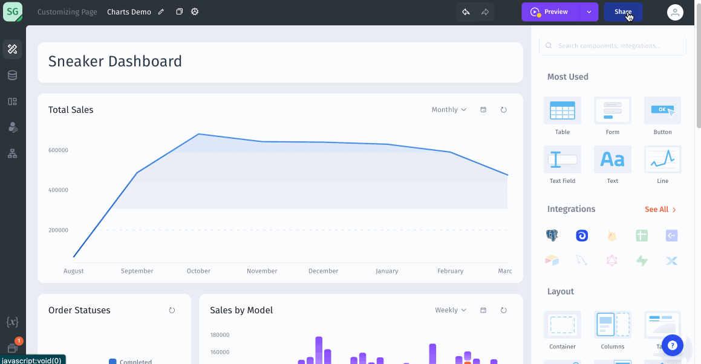
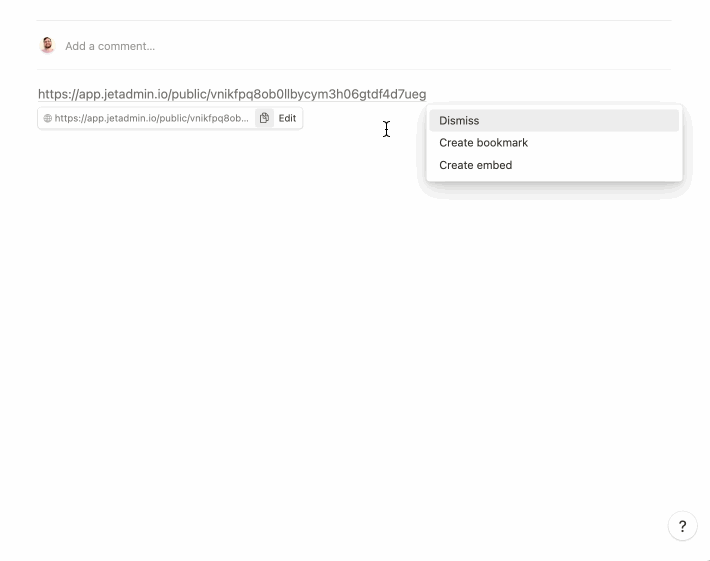

# Charts

Charts let you display and track global KPIs on the dashboard as well as provide at-a-glance performance insights. It's the fastest way to create analytical reports on your data.&#x20;

.png>)

Jet Admin has the following types of charts for visualizing data: **line**, **bar**, **stacked bar, pie,** **doughnut, single value, radar, polar area, scatter, and bubble.**

<figure><figcaption></figcaption></figure>

### Sharing charts

You can share charts that you make [by clicking on the _Share_ button in the upper right corner, just like with sharing any other app.](https://docs.jetadmin.io/user-guide/core-concept/sharing-your-app)

A specific use case that can be valuable for charts, however, is adding the charts to Notion.

To share a chart or dashboard in Notion, simply click on the _Share_ button, then go to the tab that says _Public Share._ Adding a _Public Share_ link will give anyone with the link access to your app. As such, it is usually recommended to set public link permissions to Read-only.

<figure><figcaption></figcaption></figure>

To add the chart to Notion, simply go to the Notion page that you want to add the chart to, and past in the link. Then choose _Create Embed_ in the dropdown menu that immediately appears when you paste the link.

Note that your whole app will be embedded in Notion. If you are making charts specifically to be used in Notion, you should consider this when designing your app and, for example, make use of design features such as tabs.

<figure><figcaption></figcaption></figure>

