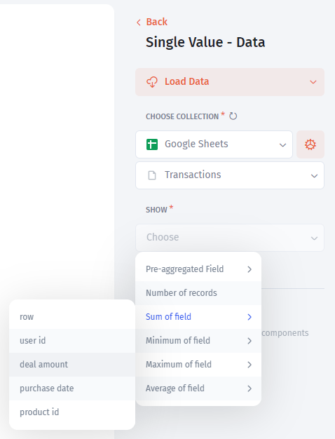
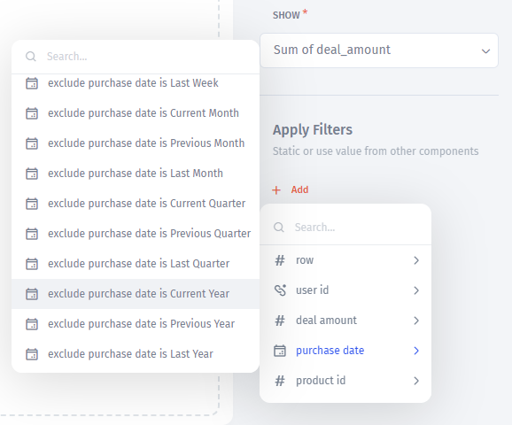
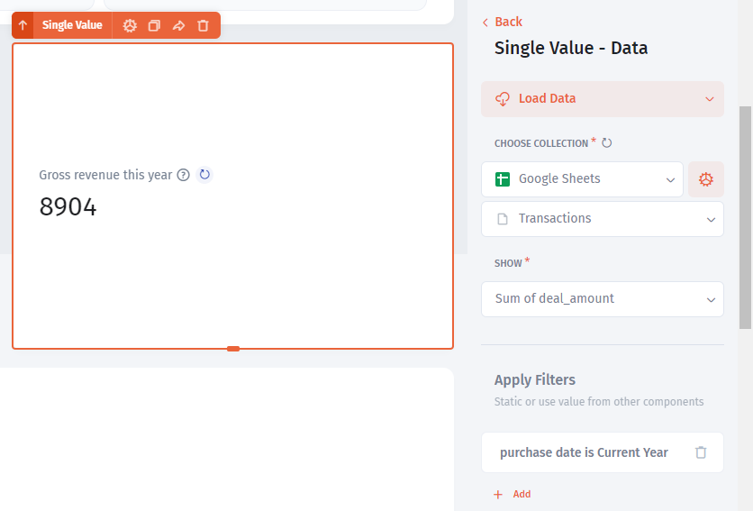
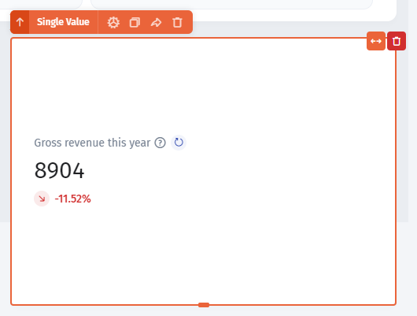
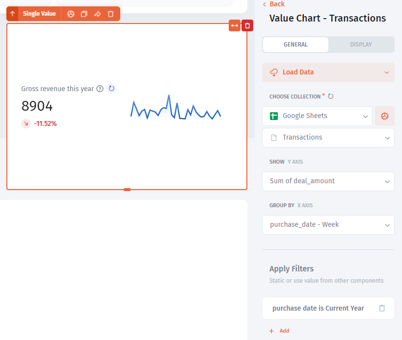
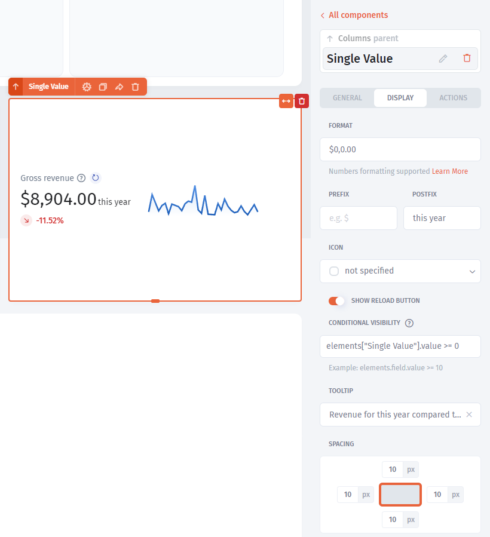
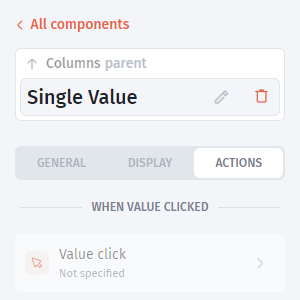

# Single value

A Single Value chart is a type of data visualization that represents a single data point or value. It is typically used to display a specific numeric value or metric in a visually straightforward and concise manner. Single value charts are often employed in dashboards and reports to highlight key performance indicators (KPIs) or important metrics. You can also display a comparison and trend chart.

.png>)

Single Value settings have three tabs: [General](counter.md#general), [Display](counter.md#display-tab), and [Actions](counter.md#actions-tab).

## General tab

In the general tab you can set up the [value to display](counter.md#setup-the-value-to-display) and its filters, a [comparison](counter.md#setting-up-a-comparison), and a [trend chart](counter.md#setting-up-a-trend-chart).

### Setup the value to display

To set up a single value, you need to select your dataset and choose which data you would like the chart to display, select the way the data to be displayed, and optionally apply filters.&#x20;

Let’s build an example Single Value chart that will display gross revenue from orders for the last year. After selecting your data source, you can select various ways of displaying the data. In this example, we will select a Google Sheet resource, a Transactions table, and a sum of the field ‘Deal Amount’:

<figure><figcaption>
Initial settings
</figcaption></figure>

You can apply Filters to your value and stack them. For our example, let us filter out by the date field and select the current year:

<figure><figcaption>
Filtering by current year
</figcaption></figure>

 

<figure><figcaption>
Plain Single Value
</figcaption></figure>

### Setting up a comparison

Comparison lets you display a percentage change from the displayed value. To set it up, you would need to select the exact value that will be compared to your main value.&#x20;

For our example, let's select the same value similar to the in the [initial settings](counter.md#setup-the-value-to-display). but filter it by the previous year.

<figure><figcaption>
Single Value with a comparison
</figcaption></figure>

### Setting up a trend chart

Trend chart will display the chart for an easier understanding of how your value changed over some period. To set it up, you would need to select the exact value that will be compared to your main value. For our example, let's select the same value as in the [initial settings](counter.md#setup-the-value-to-display), but group it by weeks, and filter it by the current year.

<figure><figcaption>
Single value with a trend chart
</figcaption></figure>

## Display tab

On the display tab, you can set up the [format](counter.md#format) of your value, a [prefix and postfix](counter.md#prefix-and-postfix), an [additional icon](counter.md#icon), show a [reload button](counter.md#show-reload-button), set up [conditional visibility](counter.md#conditional-visibility), show a [tooltip](counter.md#tooltip), and set up the [spacing](counter.md#spacing).

<figure><figcaption></figcaption></figure>

### Format

Format of your value can be made in accordance with [this guide](http://numeraljs.com/#format).

### Prefix and postfix

Can be any text added to the beginning or to the end of your value.

### Icon

You can select an icon to be displayed on the left from your value.

### Show reload button

By enabling this, a reload button will be displayed on the right of your Single Value title, allowing you to update the value by clicking on it.

### Conditional visibility

You can set up a formula for your Single Value conditional visibility here. Refer to [this page](../../../getting-started/part-2-intermediate/conditional-visibility.md) on how to set it up.

### Tooltip

By entering here your text, an ⓘ[^1] icon will be displayed on the right of your Single Value title. Hovering your mouse on it will display your text.

### Spacing

You can enter up to 4 values that will represent the number of pixels that your Single Value needs to be moved to in all 4 directions from the border to the center.

## Actions tab

You can set up an action that will be executed when the value is clicked.

<figure><figcaption></figcaption></figure>

Refer to [this page](../../design-and-structure/actions.md) on how to set up actions.

 

[^1]: Something like this!
