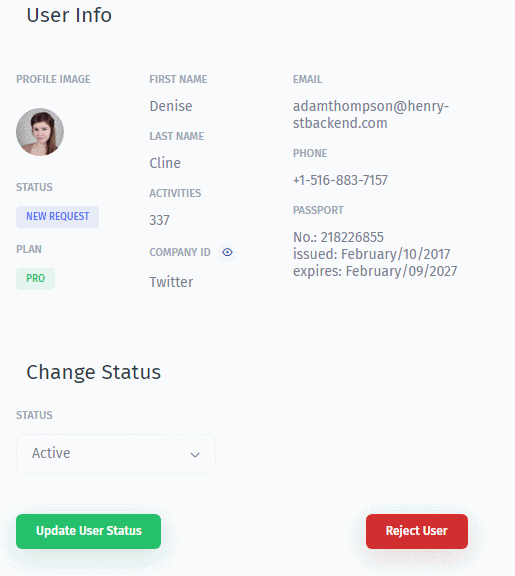
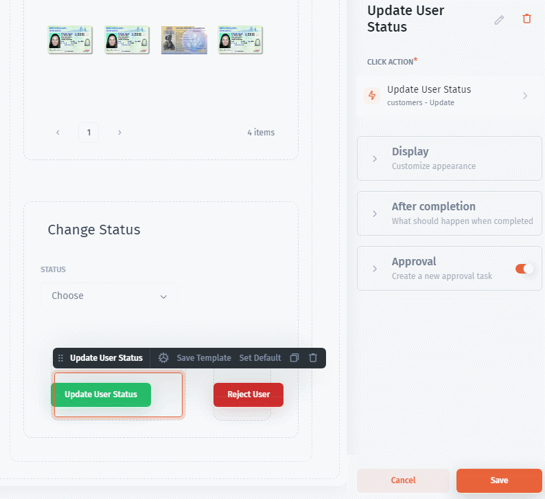

# Component Actions

Let's consider a flow where your ops or support team updates the status of a user. In that case, it makes a lot of sense for the changed values to be seen immediately after the action is executed. You can easily achieve that with the **Component Action**. The changes will be visible instantly after the button is clicked without having to refresh the page.

### Set up the "Refresh component" action

Let's look at the workflow of changing a customer's status that we've mentioned above. In this flow, the primary [action](../design-and-structure/actions.md) changes the status field in the corresponding collection and has already been configured. Now you have to set the action that will be triggered after successful completion of the primary action. That action will immediately change the status field in the chosen component. The succession of the steps to set it up will be the following:

1. Go to **After Completion** section
2. Navigate to **When action succeeded** and click **Success action**
3. Select from the dropdown **Run component action** and pick the component you need to update instantly

Now you and your teammates will see the data updates instantly after hitting the button (in our example the change of status).
