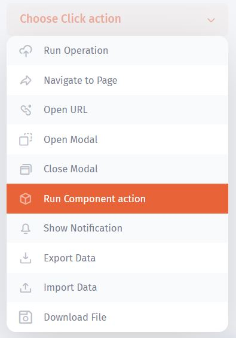
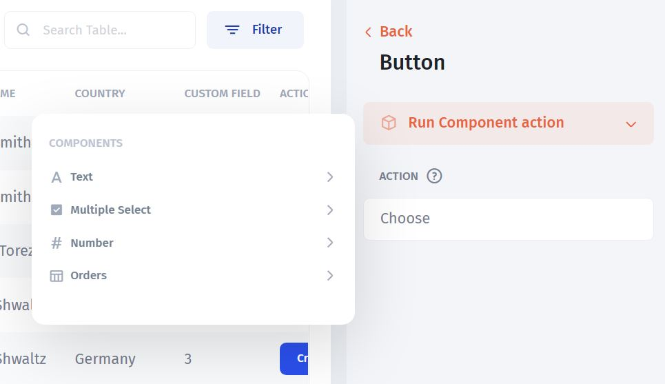
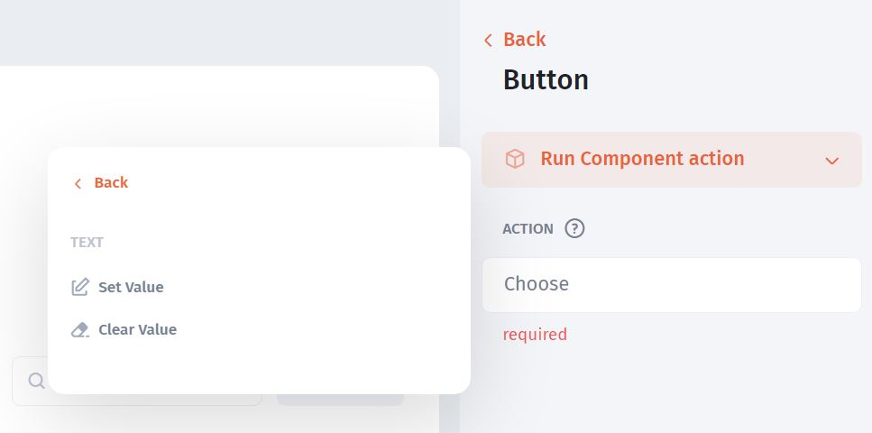
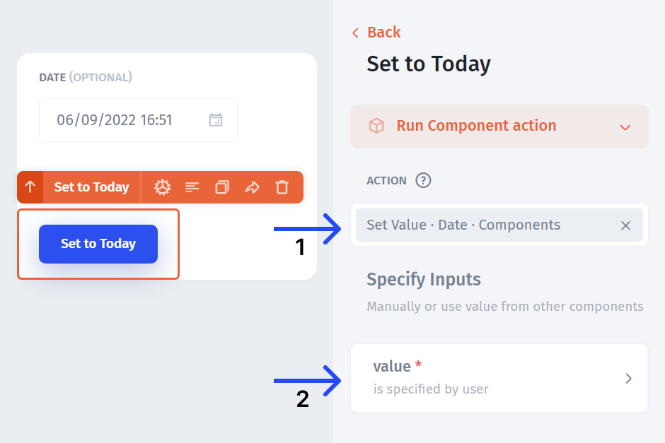
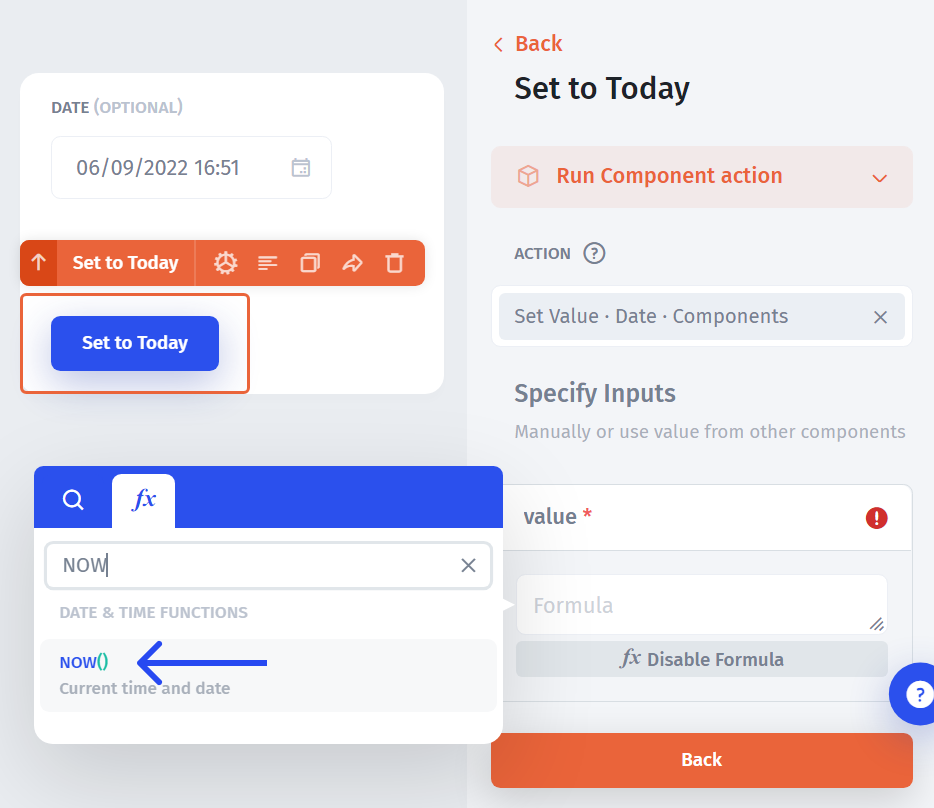
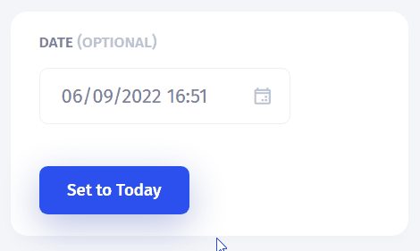

# Component Actions

Component actions allow you to **push static or dynamic values into UI components**. You can also use formulas or JavaScript to set the value.

To use this action type, choose the "Run component action" from the action type drop-down:

Then choose the UI component you want to run the component action for:

From there, you have two options: **Clear value** or **Set value**:

**Clear Value** will simply clear the value of the UI component after the action is successfully executed

**Set Value** allows you to put any value into the UI component after the action is executed.

**As an example**, let's assume we want to create a button that sets the date and time in the Date input field to the current date and time. For this, we'll need to reference the `Date` field in the "Run component action" **(1)** and specify what value we want to put into our `Date` field upon the button click **(2)**.

In our example, we want the date to be set to "Today", so we'll use the `NOW()` formula for that

As a result, we get to set the date to "Today" whenever we click a button:

