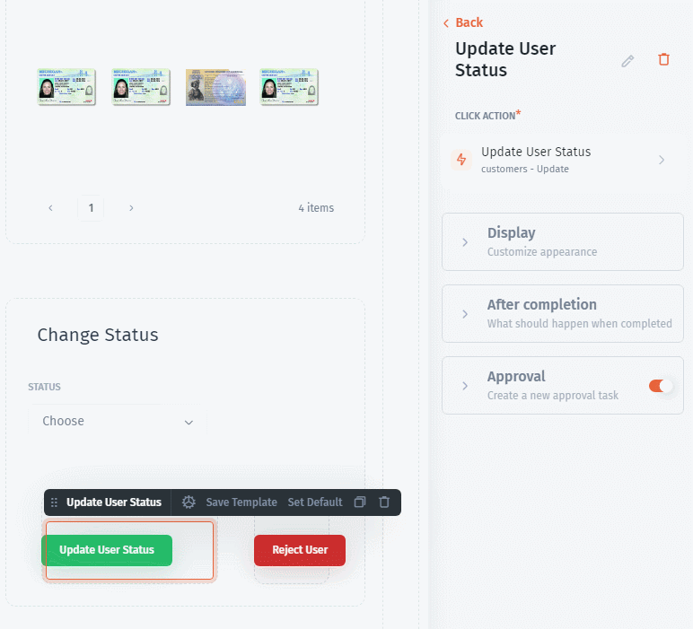
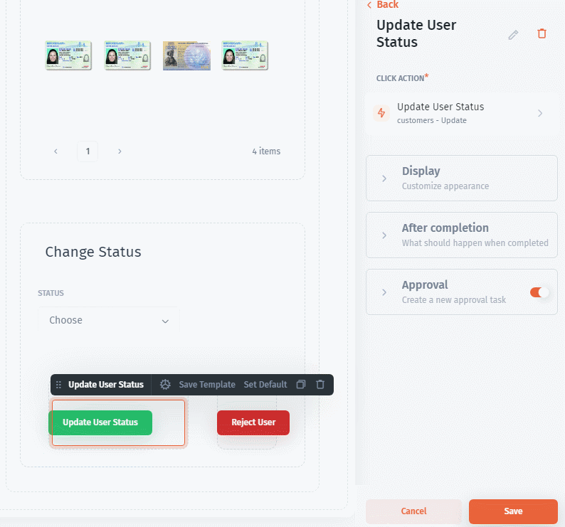

# Custom Notifications

In Jet any action that's executed comes with the notification pop-up window, displaying different messages depending on the outcome. The typical success message looks like this:

.png>)

Now you can set your own custom messaging so that our example message might be something like that:

.png>)

### Notification types

We provide 4 types of notifications: **success**, **info**, **warning,** and **error**. You can set up any of these depending on your workflow. Let's look at the two most common use cases with Success and Error notifications.

.png>)

### Set up Success notification

Let's look at the workflow of changing a customer's status, for which you have already configured a primary [action ](../design-and-structure/actions.md)to change the status field in your data source. Now you have to set another action that'll be executed after completing the primary action (status change). The succession of events will be this:

1. Go to **After Completion** section
2. Navigate to **When action succeeded** and click **Success action**
3. Select from the dropdown **Show notification** and specify: **title**, **description**, **Success type**

Now, whenever the Update button is clicked, users will see the new custom "Status Updated" notification.

### Set up Error notification

Let's consider a case where there's an error after executing an action. Error notifications in Jet usually show up with "404 or 500 status", which might be confusing to the non-tech support team. To customize our **Error notification**, we will follow the same logic as in the previous case:

1. Go to **After Completion** section
2. Navigate to **When action failed** and click **Error action**
3. Select from the dropdown **Show notification** and specify: **title**, **description**, **Success type**

Now, whenever there is an error in the process of executing the action, users will see the new custom "Error occured" notification.

.png>)
