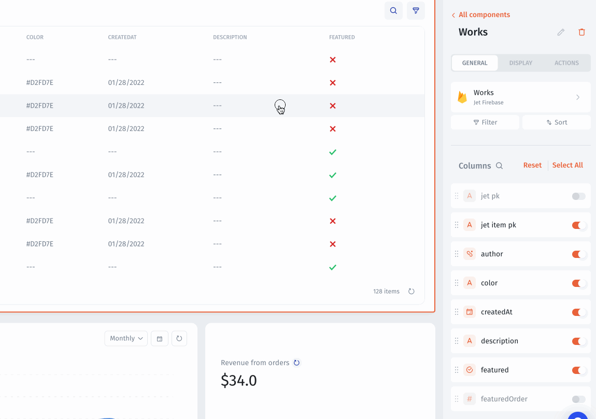

# Date & Time

A date field allows you to easily enter a date and optionally a time into a cell. When editing a date, you will be presented with a calendar widget that makes it easy to select a specific date.

.png>)

You can also select a Date format by setting up a field in the Visual Builder.

.gif>)

## Custom Format

Jet allows you to update to Date Format. The following date format you can find here: [https://www.unicode.org/reports/tr35/tr35-dates.html#Date\_Field\_Symbol\_Table](https://www.unicode.org/reports/tr35/tr35-dates.html#Date\_Field\_Symbol\_Table)

<figure><figcaption></figcaption></figure>

