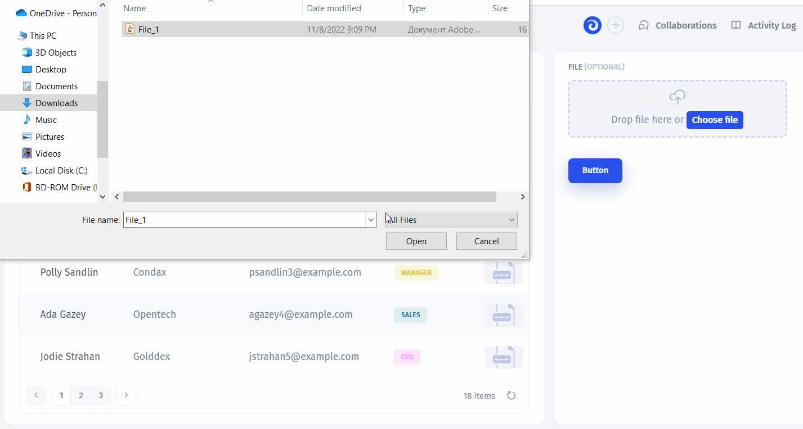

# File

### Overview

To find the File component, type in "file" or scroll down

<figure><figcaption></figcaption></figure>

File component is interactive as all inputs are, meaning you can click on the field and upload a file and then download the existing file

<figure><figcaption></figcaption></figure>

###

### Settings

There are many things you can set up in the file component settings (click on the input to access the settings menu on the right)

#### Connecting storage

Here you can **connect** one of our native integration storages, use Jet Admin's built-in storage or connect your own using REST API

<figure><figcaption></figcaption></figure>

#### Linking data

You can also reference dynamic values using the _`f`_ formula modal or set up a static value (upload file)&#x20;

<figure><figcaption></figcaption></figure>

### Multiple Files

<figure><figcaption></figcaption></figure>

<figure><figcaption></figcaption></figure>

### How to use File

There are many use-cases for the File component, so here we'll review the most common ones:

#### Uploading to Jet Tables

To upload files to Jet Tables (or any other storage), we'll need **a button** to execute the action. In addition, we might need a table to select the record the we'll upload the file onto. This table must have a column with the `File` field type

<figure><figcaption></figcaption></figure>

Next, we need to tell the button where the file value will come from. For this, we'll reference the "value" attribute from the `File` filed we dropped on the canvas


In this regard, `file` is just another type of Input field so you can perform all the referencing and binding actions as you would with text or other fields


<figure><figcaption></figcaption></figure>

Now, the button will upload the file and link it to the record we selected in the table.

<figure><figcaption></figcaption></figure>

#### Displaying files

Now, if we want to **display the file** that is stored in our table, we'll need to follow the same process: go into the `File` component's settings and reference the file field from the selected row in the Table

<figure><figcaption></figcaption></figure>
