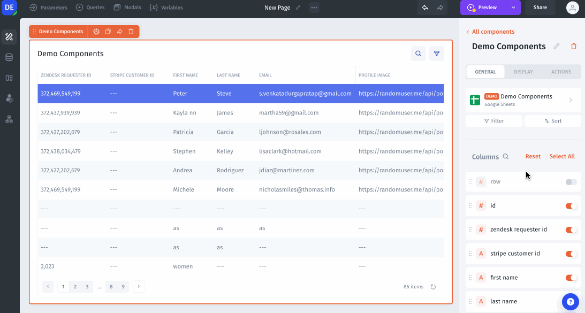

# Image

To add images to components like tables or forms, click on the field that contains the image and select the field type **Image.**

<figure><figcaption></figcaption></figure>

### **Image Options**

In the field menu, you can specify the following options:

* display – the shape of the image in the component (circular, rectangular, square)
* fit – how to fit the image in the chosen display (cover, contain)
* crop on upload – cropping options

You can also toggle on/off **Show preview on hover** and **Show fullscreen on click**.

<figure><figcaption></figcaption></figure>

### **Single file / Multiple files**

Jet gives you the ability to work with a single image file or multiple image files. When using **Multiple image files**, you will need to specify the data format as _JSON array_ or text.

<figure><figcaption></figcaption></figure>

