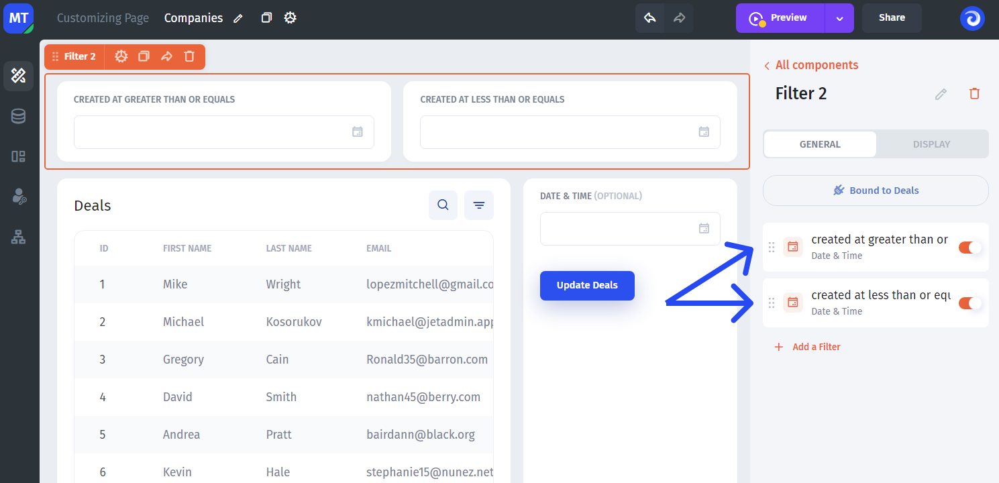

# Filters

This UI component allows you to add a filter as a standalone building block and use it anywhere on a page.


The filter component is still in development and at this point doesn't work with graphs and multiple UI components. To cover these use-cases go to the filtering section in the documentation


You can find filters in the UI building block library inside of the Builder.

<figure><figcaption></figcaption></figure>

After you placed it on the canvas, there are a few steps to make it work:

#### 1. Bind to a component

Bind a filter to a UI component that you want to be filtered. For this, click on the "Bind to component" button **(1)** and choose the Ui component from the list **(2)**

<figure><figcaption></figcaption></figure>

#### 2. Create a filter

Then add a filter, choosing the field by which you want the data in the UI component to be filtered and the logical expression, for example "greater than"

<figure><figcaption></figcaption></figure>

#### 3. Filter is ready

Now you can preview and test your filter. You can add multiple filters, they all will have AND between them by default. This can come in handy in the use-cases such as creating a date range to filter out the irrelevant dates:

<figure><figcaption></figcaption></figure>

