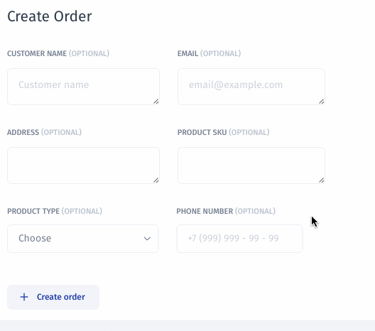
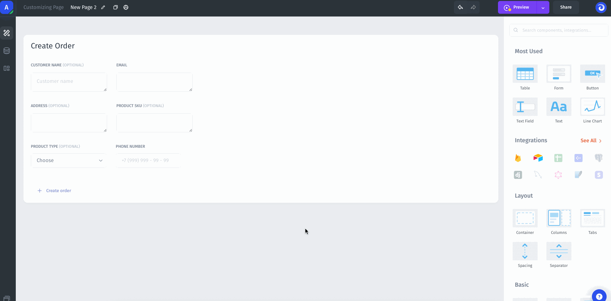
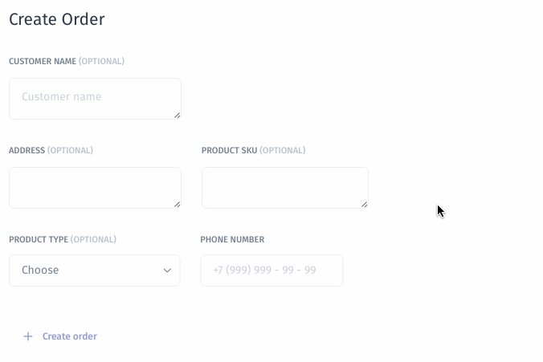
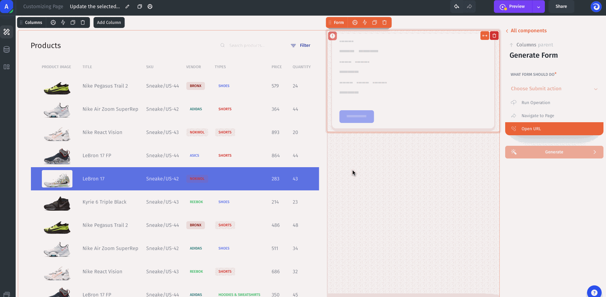
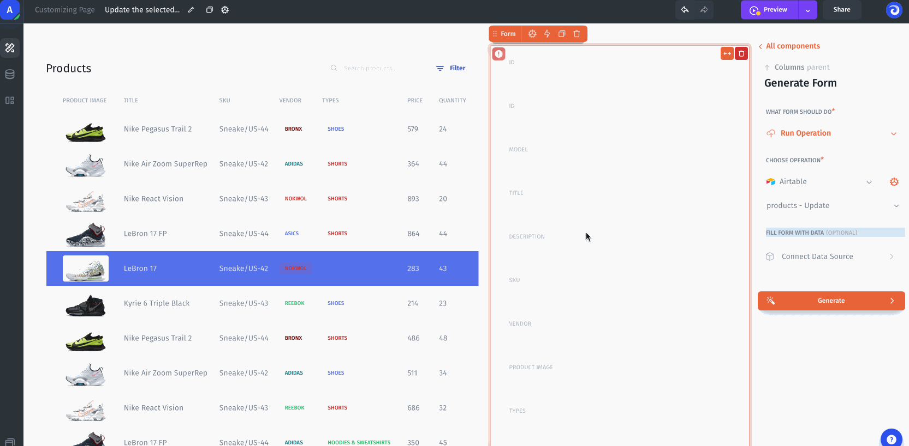
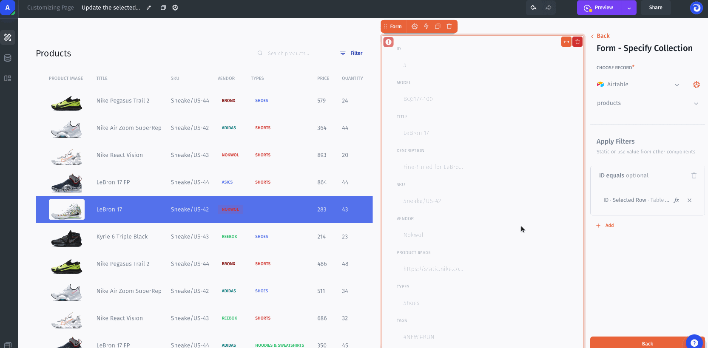

# Form

Submit a **Form** to perform actions with input data. The Form component provides a way for users to view and manipulate multiple data fields with their inputs. Upon submission, forms perform functions like creating (inserting) a new data record, updating an existing record, or [calling APIs](../data/make-an-http-request.md).

Use a form if you expect the user to interact with multiple data fields for the form's function. If you need a user to enter in an email and customer name, select an item from a dropdown, and then write a paragraph of text, forms are your best option. This is usually the best component when your function is to create entirely new data records.

.png>)


You’re looking to build a tool to allow your business to take new orders over the phone. The tool will need to record the **customer name**, **phone number**, **address**, **product SKU**, and **payment information**, and store it in your **Orders** table in your database.

Because there are multiple fields with user input, you choose to use a **Form**. For fields like the **name** and **address**, you allow the user to type in the text. For the **Product SKU** and **Payment** **Type**, you set up a dropdown selector ("Visa", "Mastercard", etc). When submitted, the form inserts a new Orders record with this data into your database.


### Create Form

To add a Form, simply drag-and-drop the Form component to the page and then choose the resource and collection for which you want to generate the form:

.gif>)


Now, when you fill out the form, you will be able to create a new record in your database.


### Customize the Form view

You can customize the form's appearance, such as arranging fields horizontally in multiple columns. To do this, simply drag-and-drop any field to the right of another field:

### Example 1: Verify inputs before submission

Sometimes you may have a process where a user needs to fill out the data fields correctly, prevalidating them (e.g., correctly typed **phone number** or **email**). To do this, you can set the Validator to the desired data field:

Now unless the user has entered the correct Email it will not be possible to submit the Form:

### Example 2: Verify the required fields are filled in

Sometimes you need to make some fields required so the user can't submit a form without specific details. To do this, check the Required option for the desired data field:


Now unless the user has entered the **phone number** it will not be possible to submit the Form.


### Example 3: Add a placeholder for the fields

Sometimes you need to add a specific placeholder for a field to hint to the user. To do that, just set a Placeholder for the desired data field:

### Example 4: Make some fields hidden

Sometimes you need to configure Visibility rules for form fields so that the user can see new fields if the previous ones are filled. To do this, just configure Visibility for the desired data field.&#x20;

Let's make the **Email** field appear only if the **Customer name** field is filled in:

Now, unless the Customer name field is filled in, the user will not be able to fill in the Email field:

See here for more details on Conditional Visibility:


[conditional-visibility.md](../components-visibility/conditional-visibility.md)


### Example 5: Update the data of the selected row

Let’s say you have a table of Products for your business. Before sending these Products over to be processed, you want a user to review and sanity-check the data in the Product, like the Quantity and Price.

You can create a form that displays the Product data, prefilling each field (like Quantity) with the current value in an editable text box. Users can quickly scan the form to review and hit a "Confirm" button to confirm the product or fix any errors they notice before confirming.

We’ll cover a step-by-step example of binding to pre-existing values below.

To bind data from a table to a form, you need to generate a form first with the same resource and collection (Airtable - Products) by selecting the operation type (in our case it is Update operation):

Now you need to configure the "Fill form with data" section. To do this, simply click on the Connect Data Source button and Jet Admin will automatically select the desired resource and collection (the same one used in the form):

Next, you need to apply filters, namely a data filter on the primary key (in our case it is the product ID). This step is important for the form to display exactly the data you selected in the table (selected row):

Now we just need to generate the form and we're done:

### Example 6: Sequence of Forms

In most cases, you need to create a sequence of forms in which filling out one form should redirect the user to another form. See here for details:


[actions-workflow.md](../workflow/actions-workflow.md)

