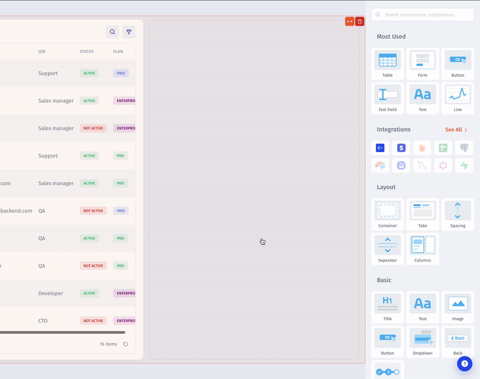

# IFrame

An embedded web page that supports permissions to allow or deny downloads, form submissions, microphone, and camera access, and popups.

Use an HTML component to include custom HTML and CSS instead of an embedded web page. You can also use a [Custom Component](custom-component.md) to include custom React, HTML, and JavaScript.

<figure><figcaption></figcaption></figure>

\
