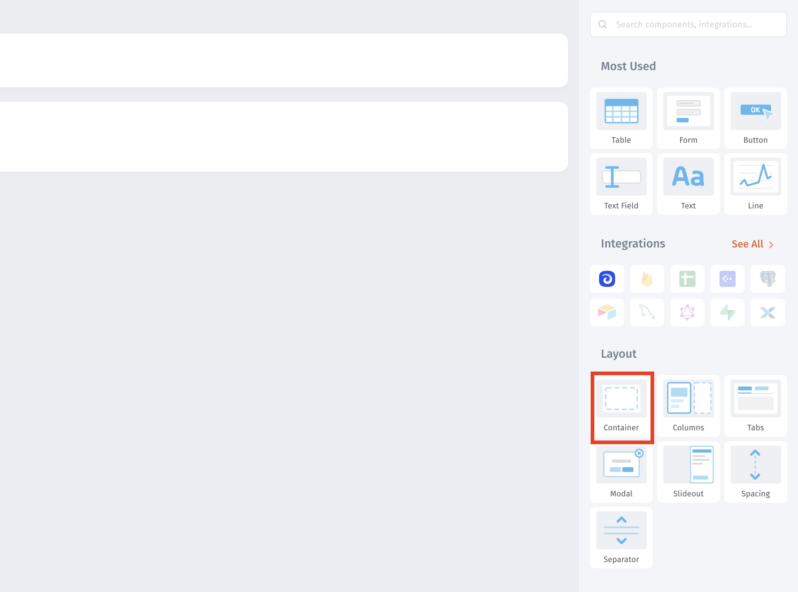

# Containers

Containers allow you to group different components and visually separate them from others.

Before:

<figure><figcaption></figcaption></figure>

After using Containers:

<figure><figcaption></figcaption></figure>

Drag-and-drop Container from the right sidebar.

<figure><figcaption></figcaption></figure>
