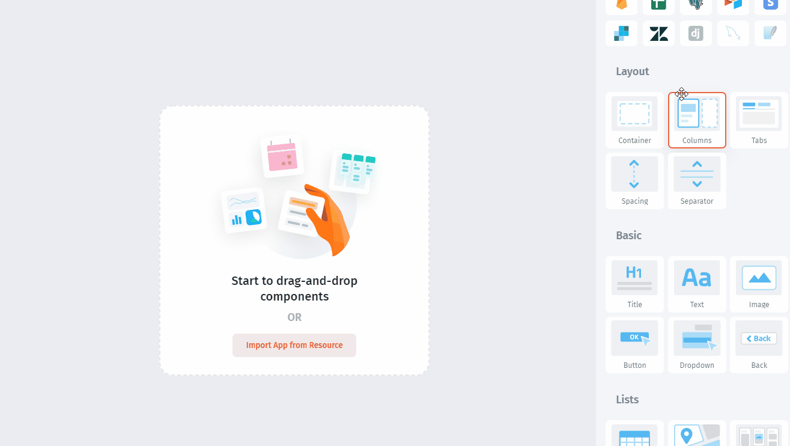
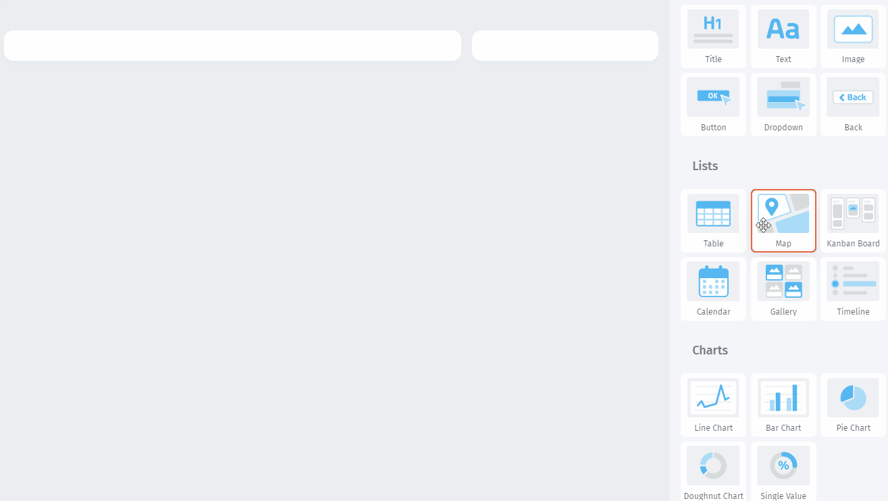
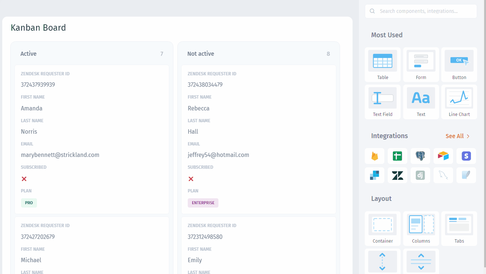
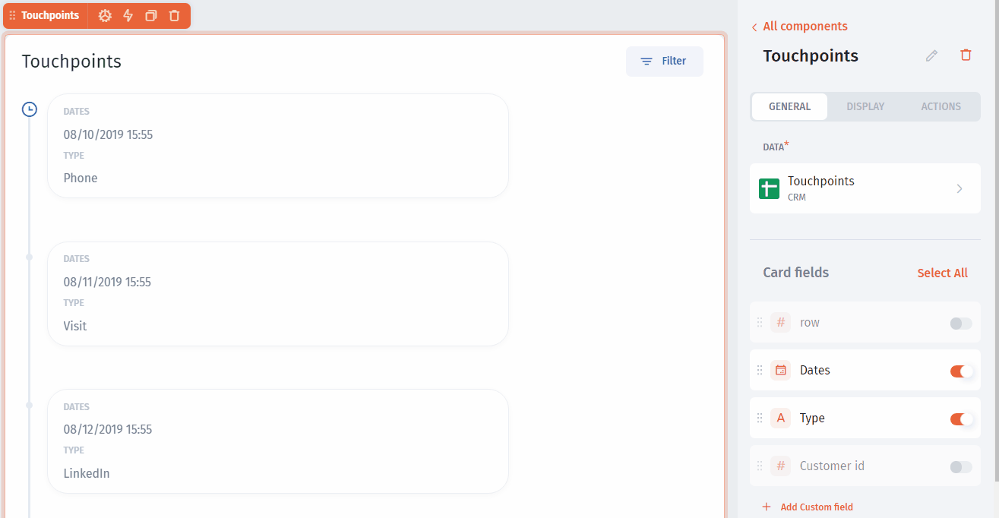
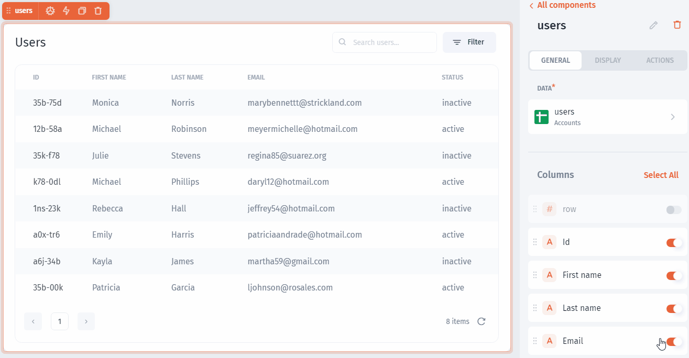

# Lists

There are several ways how you can display the same collection in Jet Admin:

* [Table](../../design-and-structure/components/lists/table/)&#x20;
* [Map](map.md)
* [Kanban](kanban.md)
* [Calendar](calendar.md)
* [Gallery](gallery.md)
* [Timeline](timeline.md)


Check the steps below to familiarize yourself with common **Lists** features


### Setting the Layout

To assemble UI components on the page the way your case requires, use one of the `Layouts` components:

### Adding list component

To add any `component` to the page simply drag-and-drop it:

### Card fields and Columns

`Columns` for the Table components and `Card fields` for other Lists components can be customized by rearranging, enabling/disabling flags, and changing field types:

### Selection function

Any Lists component in Jet Admin has the `selected row` or `selected card` functions that can be used to trigger all sorts of actions as well as fetching values from selected records:

### Actions

Using `selection function` you can also configure actions for any of the Lists components:

There are two ways to set actions:

1. `Row click` or `Card click` actions will be triggered when a row or card is clicked
2. `Header action` will be triggered after selecting a row and hitting the header button

### Pagination

You can limit the number of records displayed in one of the Lists components:&#x20;

### Search

You can enable Search for any of the Lists components:

.gif>)


[actions.md](../../design-and-structure/actions.md)

