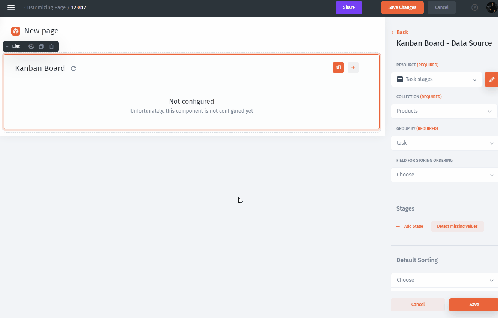

# Kanban

A kanban board is often used to simplify and visualize complex processes, for example, user onboarding or shipping.

**Kanban Cards** – This is the visual representation of tasks. Each card contains information about the task and its status such as dish name, the dish is being cooked, the dish is ready, etc.

**Kanban Columns** – Each column on the board represents a different stage of your workflow. The cards go through the workflow until their full completion.

.png>)

### Kanban data settings

For example, you have the following stages in tasks: not started, in progress, review, and completed. To set up Kanban stages specify the `group` field then set `stages`.

More information about Display Settings, Search and Action you can find in our documentation.


[.](./)


