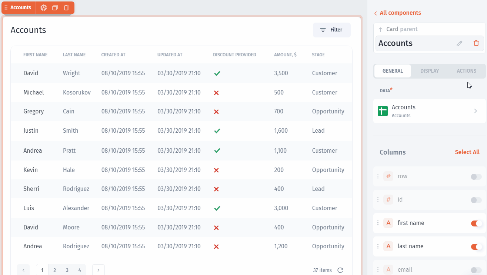

# Table

### Table component

Use `Table` component to view and interact with data from your collections:

.png>)

### Adding Table&#x20;

Adding components explained [here](./#adding-list-component).&#x20;

### Table Settings

You can customize any component in Jet Admin and the Table component is not an exception. You can rearrange columns and enable/disable them:

On top of it, you can customize each field individually, for example, change the name of a column or change the field type:

### Search

You can enable Search for your table, just enable the flag:

### Selection function

Any `table` in Jet Admin has the `selected row` function that can be used to trigger all sorts of actions as well as fetching values from selected records:

### Actions

You can trigger actions for the selected row function. For example, you can open a modal pop-up or navigate to a record page:


When you connect SQL DBs, Firebase, Airtable, or Sheets, Jet Admin automatically generates all the **CRUD** actions - just select them from the dropdown



[.](./)



[actions.md](../../design-and-structure/actions.md)

