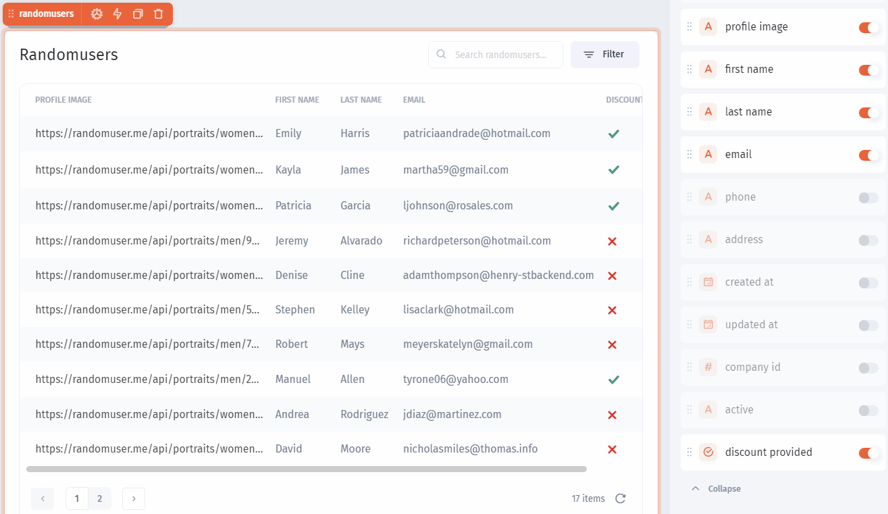
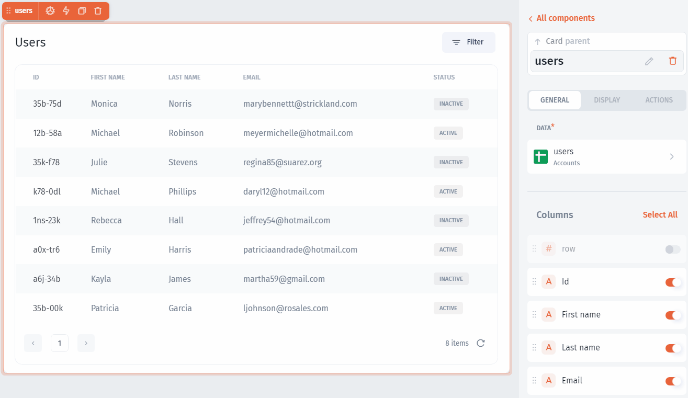
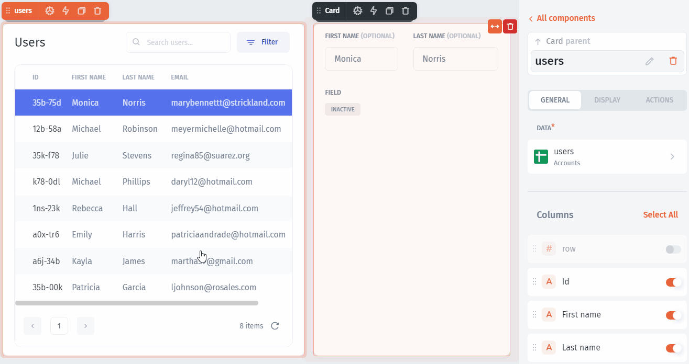
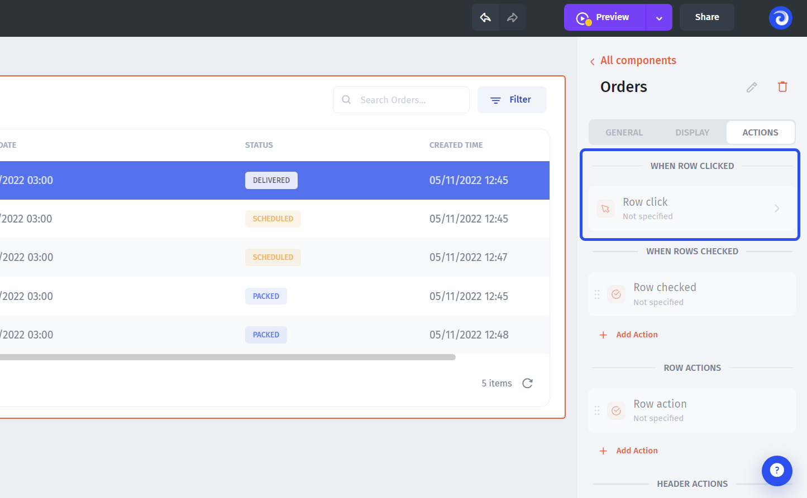
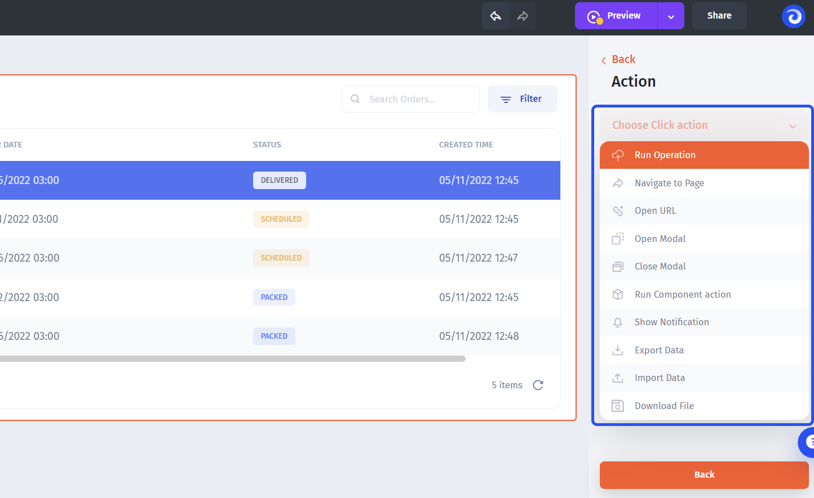
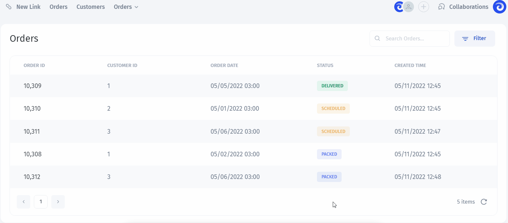

# Table

### Table component

Use `Table` component to view and interact with data from your collections:

.png>)

### Adding Table&#x20;

Adding components explained [here](./#adding-list-component).&#x20;

### Table Settings

You can customize any component in Jet Admin and the Table component is not an exception. You can rearrange columns and enable/disable them:

On top of it, you can customize each field individually, for example, change the name of a column or change the field type:

### Search

You can enable Search for your table, just enable the flag:

### Selection function

Any `table` in Jet Admin has the `selected row` function that can be used to trigger all sorts of actions as well as fetching values from selected records:

## Actions

Table is an interactive component which means you can bind all **different kinds of actions** to it. You can configure:

* Row click
* Rows check
* Inline action
* Header action
* Hover action

To proceed to the actions, select the table and click on the **"Actions" tab**:


For the **Hover action**, you'll need to drill down into an individual column in the column settings (see the "Hover action" section below)


### Row click

When the Row click action is enabled, the specified action will be executed once a row is clicked. You'll be able to use any value from a selected row in the action. Now, click on it:&#x20;

The most **common use-case** for the "Row click" action is drilling down into the record or proceeding to the page with more record-related data (you'll need the "Navigate to Page" action type for that). But you are free to use any action type.


Learn more about different types of actions in the [Types of action](../../design-and-structure/actions.md) section


Here's an **example** of how that might look in the user-mode:


**It's crucial** to understand how **data is bound** under the hood when linking pages. Otherwise, things might break when customizing the auto-generated pages or building the drill-downs from scratch.&#x20;

Please, **read more** in the [Values section](../../parameters/)&#x20;



When you connect SQL DBs, Firebase, Airtable, or Sheets, Jet Admin automatically generates all the **CRUD** actions - just select them from the dropdown



[.](./)



[actions.md](../../design-and-structure/actions.md)

