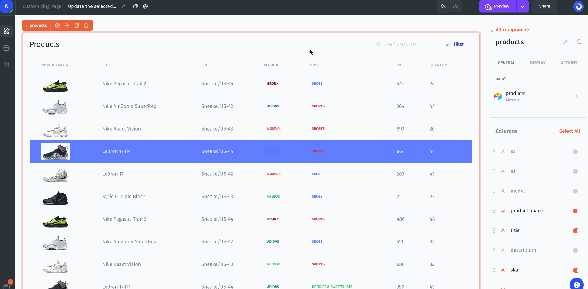
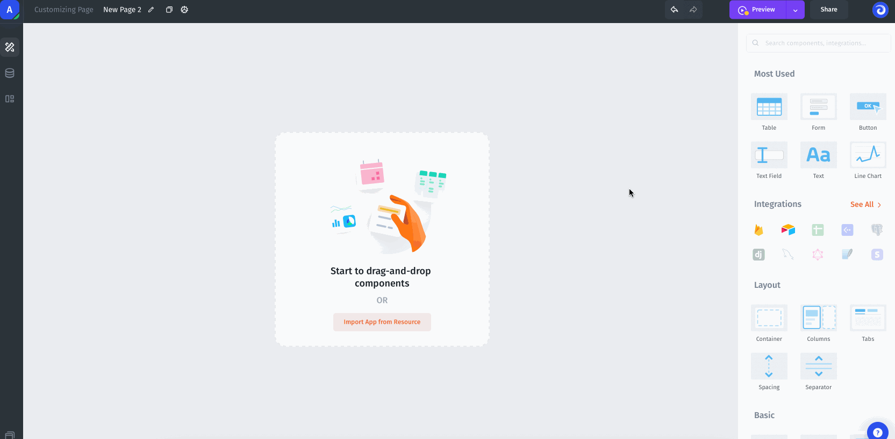
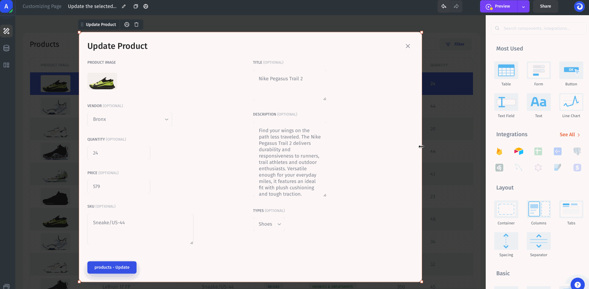
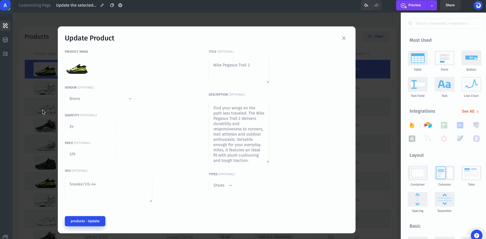
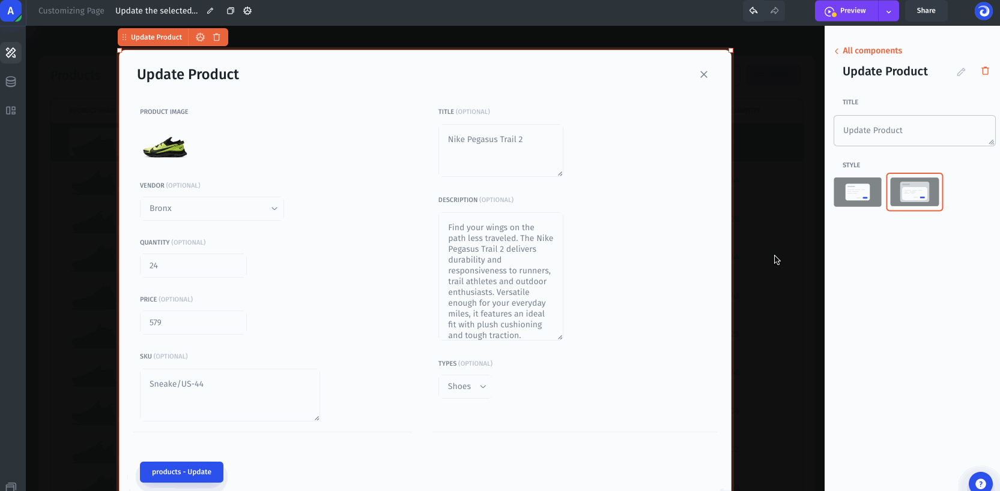
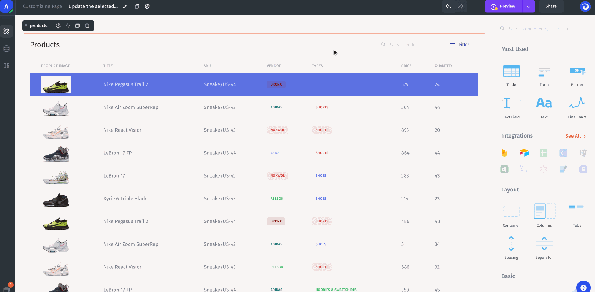
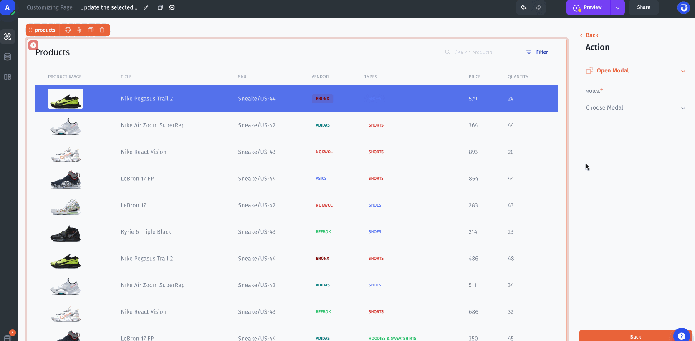
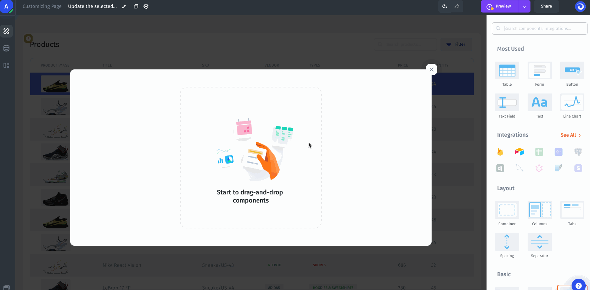
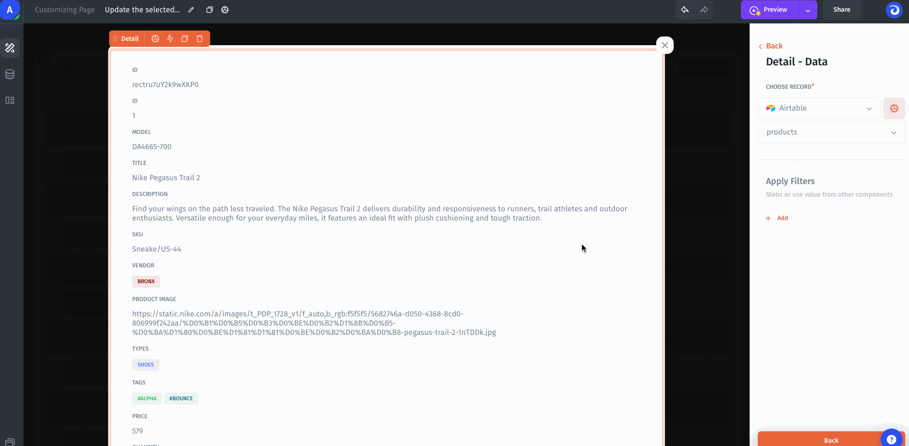

# Overlay

Before we get into the nuances of using an overlay in a JetAdmin app, it’s probably worth taking a moment to define what an overlay is in the first place.&#x20;

Overlays are windows - both large and small - that “pop” onto the screen when an action is taken. Sometimes these come in the form of a warning (e.g. “Are you sure you want to delete that?”) and sometimes they can be in the form of something useful (e.g. clicking a "view details" button and seeing the specifics about an object).&#x20;

Overlays allow you to both save space as well as present the right information at the right time.

### The basics and properties

To add an overlay into your application, find one of the components "modal" or "slideout" from the component sidebar on the right and drag it onto the page.

After closing the overlay, you can open it again in the builder by clicking the "overlays" button on the top-left menu, as shown on the image below.

<figure><figcaption></figcaption></figure>


An overlay acts as a page does, meaning that you can drag-and-drop other components into it when it’s open in the builder.


You can change the width of the overlay window and the content will automatically be adjusted:

Overlay windows in Jet Admin have various display styles. You can change it in the settings:

You can also set the title for the Overlay window in different ways. The title can be a **static** value or a **dynamic** value using formulas (e.g., you want to display Update Product # \{{id\}}).&#x20;

See here for more details on how to use the formula functionality for dynamic values:


[formulas.md](../formulas.md)


### Open an overlay from a Table

You have a table that displays a list of Products. After clicking on the product row (the selected row) you want to see product details - displayed in an overlay. To do this, let's set up a Row click action with the **Open Overlay** type:

Next, you can choose a created and configured overlay or create a new one:

Now let's add a Detail component to the overlay window to display detailed information:

Next, you need to apply filters, namely a data filter on the primary key (in our case it is the product ID). This step is important for the form to display exactly the data you selected in the table (selected row):


Now, when you select a row, the overlay window will open with product details.


