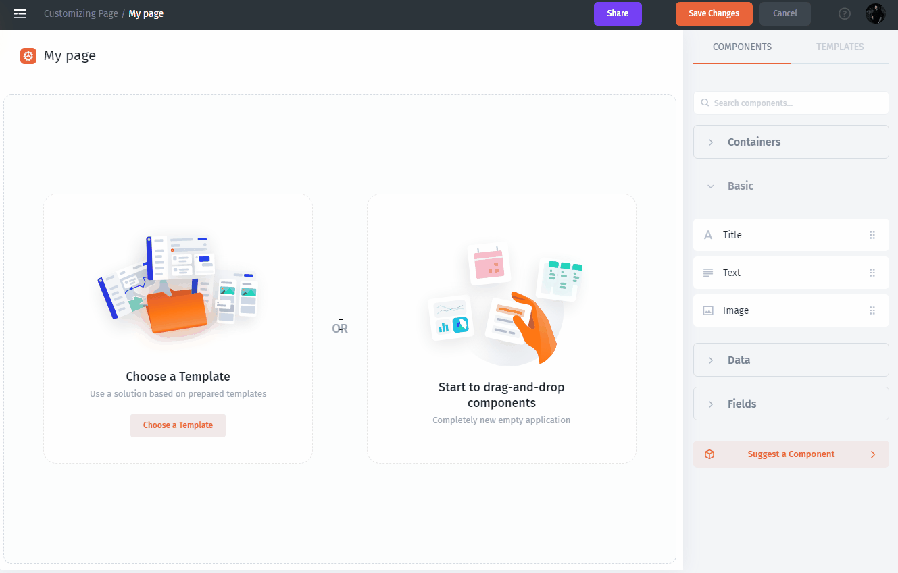

# Text

Text or title is a static item that you can specify, for example, to put a title **Statistics** by simply drag-and-drop the item to the page.

You can also specify a static element with text as a description for any component.

