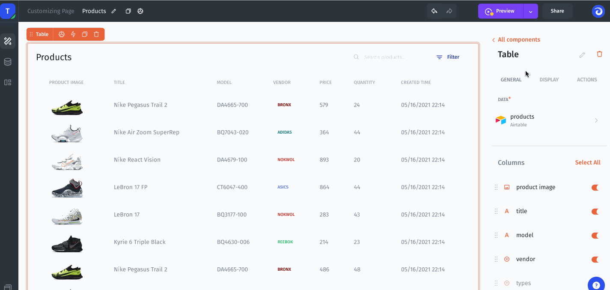
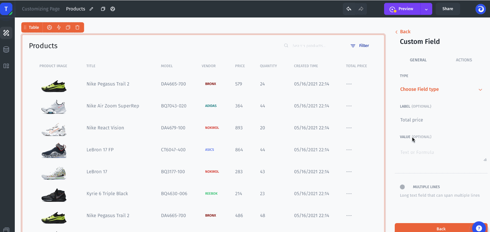

# Math Column

Let's suppose you need to calculate the total cost by multiplying the Price and Quantity fields:\
\
1\. Simply create a new Custom field in columns settings of table component:

2\. Now we should configure Value for that Column. We will use \* operation to calculate Total cost value:

`=item.Price * item.Quantity`

3\. Now let's concatenate the Total cost with the currency $ using CONCAT() function:&#x20;

`=CONCAT("$", item.Price * item.Quantity)`

