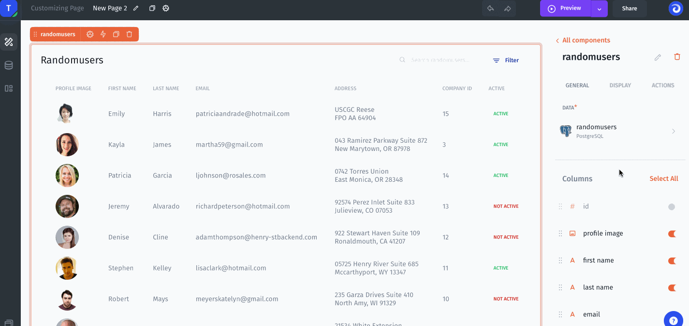

# Relations

Relations can be used in Jet Admin to create relationships between rows, linking together their data across tables.

The related field allows you to represent the relationships between related records by creating links between them. This is particularly helpful when you have multiple tables of related items. For instance, if you have a table of `Customers` and a table of `Companies`, you can use a related field to link each `Customer row` to the `Company` that they work for.

### Single relations

Single relations show a _one-to-one_ relationship. This is where one item relates to one other item.

### Multiple relations 

Multiple relations show a _one-to-many_ relationship. This is where one item relates to a list of other items.

### How to create relations in Jet Admin 

In Jet, you can create relations between values using a **Link to record** column. With this column, you specify the type of relation you want - single or multiple. Your project then applies the relation to the values and tables specified.

### Check for matching values 

Before adding a **Relation** column, you must first check that the values match in the columns that will be connected. Items cannot be linked together unless they match.

In this example, each employee in `Contact` has a `Company` they work in.

1. In the `Contact` table, make sure there’s a column for the name of the employee’s `Company`.
2. In the `Company` table, make sure there’s a column for the name of the location that can be tied to the `Contact` table.

### Build single relations 

Here we'll show how to simply create a related Company field for each Customer. Each customer has `company_id`, to display and link the company in the Customer table let's specify `link to record`. There are 3 steps to setting up a related field:&#x20;

1\. Specify the type for a `company_id` column as `Link to record`&#x20;

2\. Specify `related collection` then select `related field` and select `Display field` to display it on the Customer table:


Related field and Display field are set automatically under the context but you can change these values.


### Build multiple relations 

