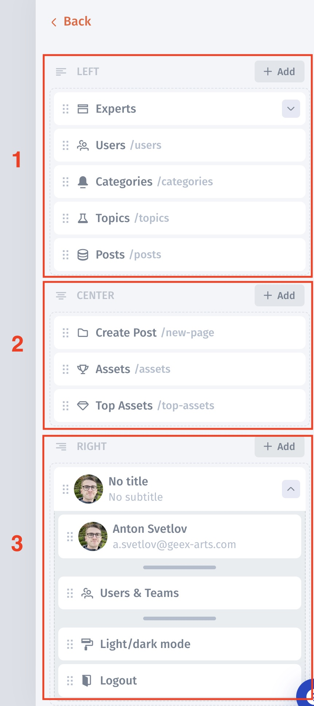

# Navigation

The navigation bar helps users find their way around your app. While in the builder mode, you can access all the pages. The great news is that Jet allows you to craft as many as three menus and combine them. And guess what, you can also personalize your navigation! Here's how you can do it:

1. Configure menu layout
2. Manage menu Items
3. Set up the menu background color
4. Enable/Disable the menu, set conditional visibility via the Fx button

<figure><figcaption></figcaption></figure>

## Configure Menu Layout

There are two types of menu layouts **Vertical** and **Horizontal.** Each class has different visibility:

<figure><figcaption></figcaption></figure>

**Vertical  (Left positioning)**

* Thin width
* Wide width

**Horizontal (Top positioning)**

* Primary menu
* Secondary menu
* Inner menu – if you would like to use a combination of a vertical and horizontal menu

## Configure Menu Colors

You can apply different colors to the menu background. Select menu -> click **Color**

<figure><figcaption></figcaption></figure>

## Manage menu Items

There are three menu item positionings that you can put items depending on layout:

1. left/top&#x20;
2. center&#x20;
3. right/bottom

<figure><figcaption></figcaption></figure>

### Menu item types

Customize the menu items by:

* Adding new links to your internal/external pages
* Grouping menu items by using Group&#x20;
* Adding Components
* Rearrange menu items

.png>)

#### **Grouping menu items**

Grouping allows you to group different menu items in sections or dropdowns.

* Section

.png>)

.png>)

* Dropdown

.png>)

.png>)

* Separator

.png>)

#### .png>)

#### **Menu item Links/References**

* Page
* Custom Link
* Section
* App Logo
* Current User
* Icon / Image
* Button
* Dropdown
* Separator
* Open Home
* Open User Profile
* Open Users & Teams
* Open Activity Log Slideout
* Open Activity Log Page
* Open Collaboration Slideout
* Open Collaboration Tasks
* Open Collaboration Messages
* Toggle Light/Dark mode
* Logout
* App members
* [Custom Component](../../../../videos/component-designer.md)

.png>)

#### **Menu Item Components**

* App logo

.png>)

.png>)

* Current user

.png>)

.png>)

* Icon/Image

.png>)

.png>)

* Button

.png>)

 (1) (1) (1) (1) (1) (1).png>)

* Logout

.png>)

* App members

 (6).png>)

* Toggle light/dark mode

.png>)

###

### Menu item Conditional Visibility

Jet allows you to set up Conditional Visibility for each menu item, as well as the whole menu bar.

Click on menu item settings -> **Customize item.**

.png>)

<figure><figcaption></figcaption></figure>

