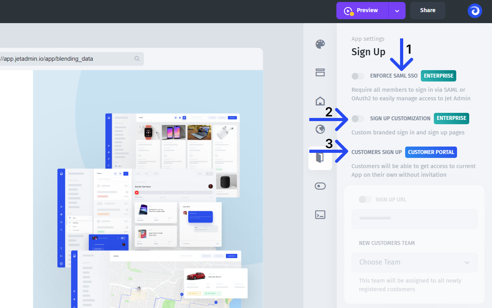

# Sign Up

If you need to create a sign-up/sign-in page for the users of your app, Jet Admin already has a built-in one that you can tune and customize to suit your case.

You can white-label the whole sign-up/sign-in page, replacing a **favicon**, Jet Admin **logo**, **brand images** on the right side, and **domain**.


At the moment, the out-of-the-box white-label functionality is in development, so you'll need to send the materials listed above manually in the support chat


There are several ways you can further customize the sign-up/sign-in page:

* **(1)** You can set **your authentication** system with your own auth provider (reach out to sales or support if you need that option)


Google SAML SSO is already set and available in all plans


* **(2)** If white-label is not enough, you can completely set up a fully **custom sign-up page**, using your styles and colors.
* **(3)** If you're building a customer portal, you might want to set up the **invitation process** through a public link. New customers will sign up through an auto-generated URL and automatically assign a selected team.

