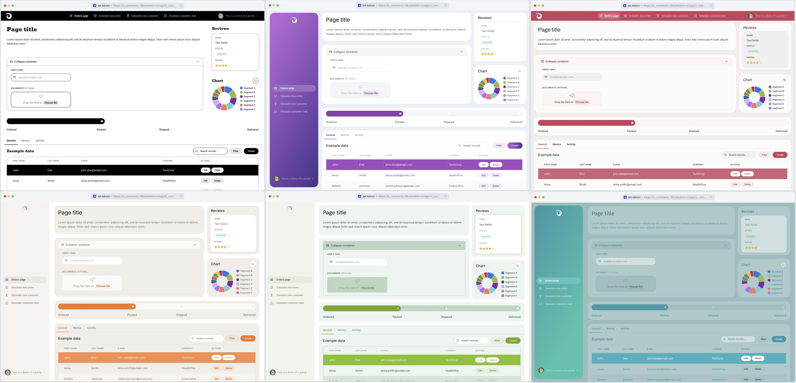
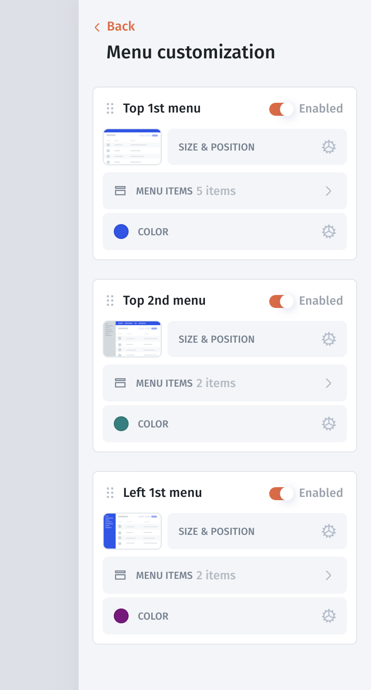

# Theme & Styles

## Themes

Themes allow you to create a consistent look across your apps. You can either use pre-built themes or customize your own for a personalized experience.

<figure><figcaption></figcaption></figure>

#### Theme Gallery

Start with 10+ ready-to-use themes, available in both light and dark modes. These themes can be quickly applied across your apps.

<figure><figcaption></figcaption></figure>

**Steps to Apply a Theme:**

1. Go to **App Settings** > **Appearance**.
2. Select a theme from the **Theme Gallery** or create your own by choosing **Customize Theme**.
3. Adjust **general styles** (fonts, colors, etc.) to fit your needs.



You can also apply general settings to components such as buttons, fields, and cards to maintain a consistent appearance.



## Styles

Each component in your app can be styled individually, allowing for more detailed customization beyond the general theme.&#x20;

<figure><figcaption></figcaption></figure>

<figure><figcaption></figcaption></figure>

#### Text Style

To style text within a component, scroll down to the **Text Style** section in the component's **Display** tab. Here, you can adjust font type, size, color, and other properties, ensuring that the text aligns with the overall design of the app.



#### Component Style

For detailed customization, you can style components like Buttons, Fields, or Cards. In the Component Display tab under the Style section, you can modify properties such as borders, background, label, shadow, inner/outer spacing, as well as styles for different states like hover, focus, and error. This allows for precise control over the look and feel of individual components.



#### Menu Style

To style your menu, go to the Menu Style section in the Display settings of the Menu component. Here, you can adjust the height, background, border, corner radius, and outer spacing, ensuring the menu fits seamlessly with your app’s overall design.



#### Page Style

In the Page Settings, you can adjust the overall page appearance. This includes modifying bounds, background, text colors, and border colors. These options help you maintain a consistent style across your pages and align them with your theme.


