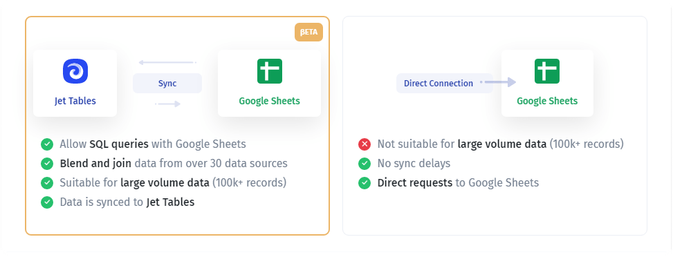
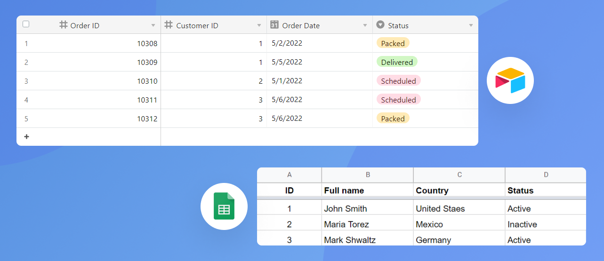
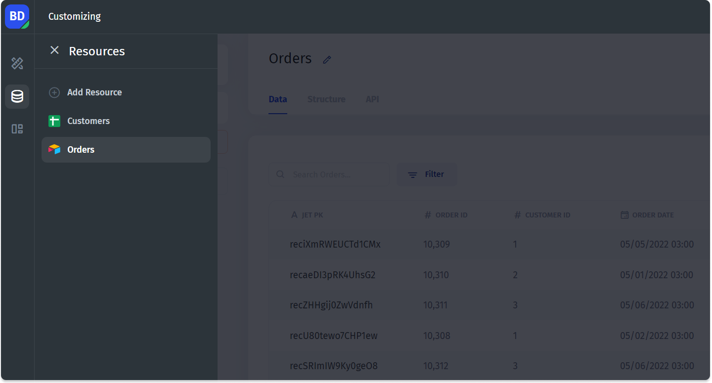
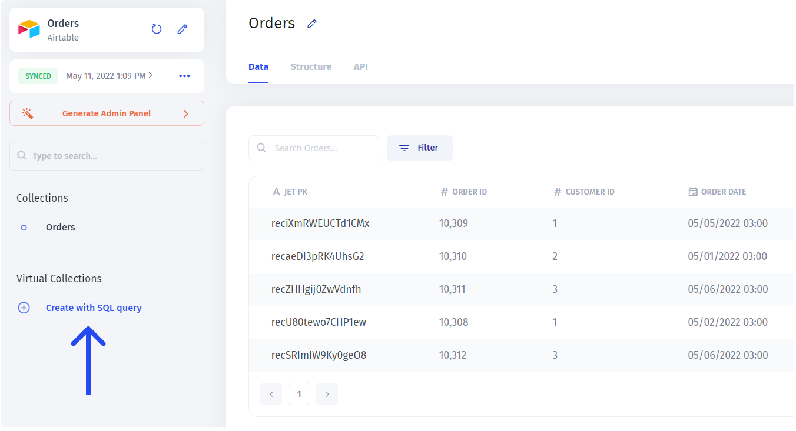
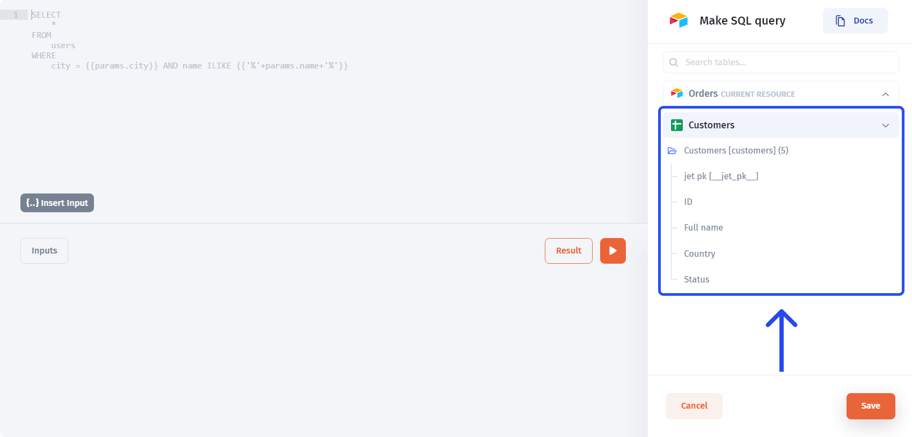
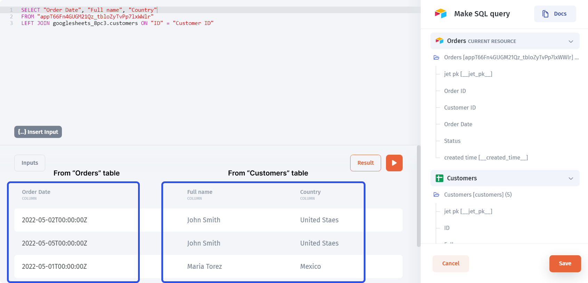
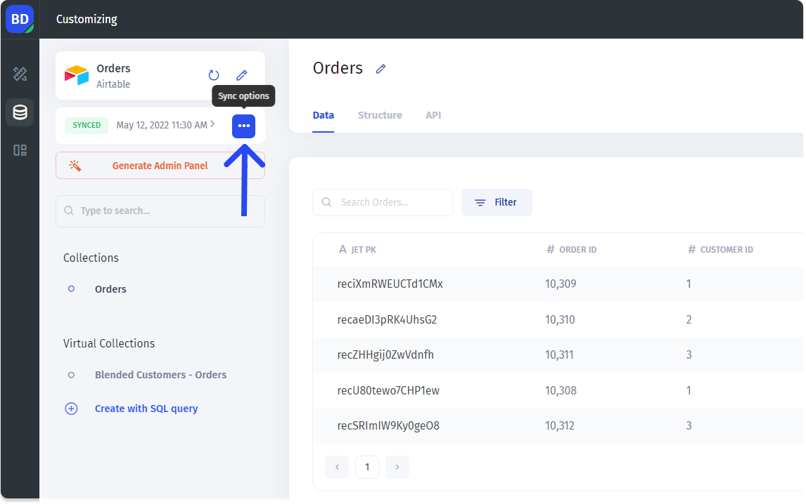
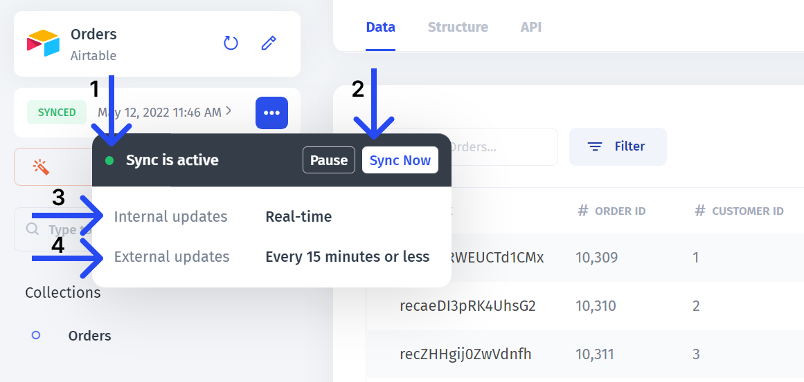

# 💠 Data Blending

Data blending allows you to **merge (join)** pieces of data from different (multiple) data sources. Typically, to do that, you'd need a data warehouse, but with Jet, you can do it without any additional software or services. You can also write **SQL with non-SQL** data sources.&#x20;

You can even layer the above capabilities to transform your data the way you want regardless of where it comes from.


**All the data sources** you want to be able to blend from have to be connected through the "Sync connection"


## Sync Connection

While connecting a data source, you'll be prompted to choose the type of a connection, there could be a **direct connection** or a **sync connection**:

Choose the sync connection to unlock all the features listed above. Under the hood, it will use Jet Tables - Jet's built-in SQL database as the medium for syncing.


At the moment, the sync connection is available for a limited number of integrations. If you want us to prioritize a specific data source, please let us know in the support chat


## Blending the data

To demonstrate how the data blending works, we'll use two data sources: Airtable and Google Sheets, where the former contains the `Order` table and the latter - the `Customers` table. Notice that the `Customer ID` column in the `Orders` table refers to the `ID` in the `Customers` table.

Once you've connected your data sources (read more on particular integrations [**here**](integrations/)), proceed to the data section and pick a data source where you want to perform the blending _(you can choose either one, it's just a matter of convenience)_

Then create a new virtual collection:

You'll see all the data sources you've connected using "Sync" on the right. You can now pick the columns and use them in your query:

And after writing and running our query, we get the resulting table, containing `Full name` and `Country` columns from the `Customers` table together with the `Order Date` column from the `Orders` table.

After saving changes, we get a collection with joined data that we can later use in the interface.

## Sync options

The sync parameters can be changed in the **Sync options** tab. To get there, click the three dots in the top left corner of your data source page:

The syncing consist of two parts: the `Data source` - `Jet tables` connection (referred to as **External updates**) and the `Jet tables` - `Interface` connection (referred to as **Internal updates**). The latter pair is syncing in real-time while the former one's syncing interval can be changed


At the moment, the external updates interval can only be set on the side of Jet Admin, so if you need to change it, reach out to client support


In the sync tab, you can:

* View the **status** (could be <mark style="color:green;">active</mark> or <mark style="color:yellow;">paused</mark>) (1)
* Control the sync: **pause it** or perform a **manual sync** - Sync now (2)
* View the **Internal updates interval** (3)
* View the **external updates interval** (4)

To learn more about using SQL queries in Jet Admin, please refer to this page:


[reading-data-from-sql.md](../getting-started/part-2-intermediate/reading-data-from-sql.md)

