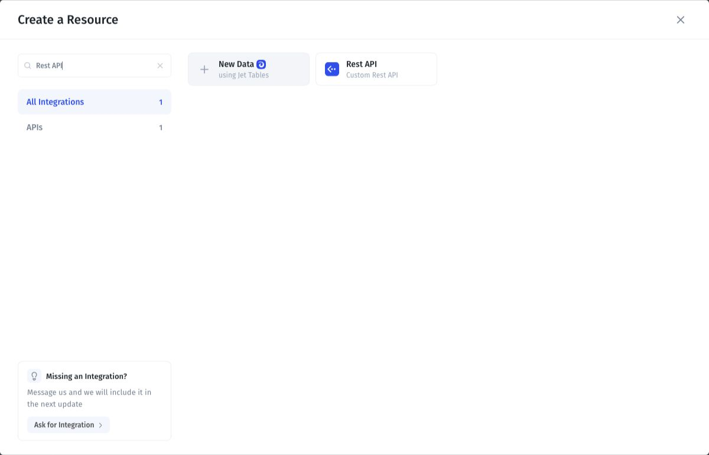
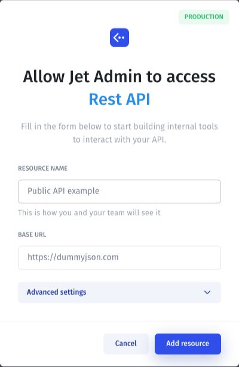
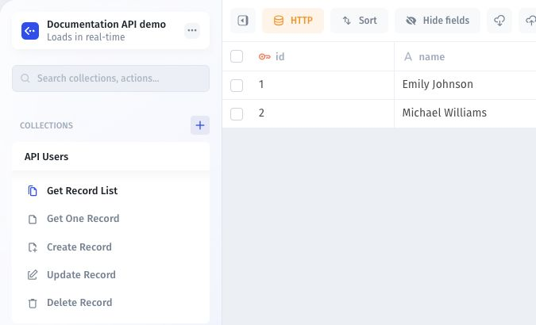

# Connect your first data source

Connect an existing source and check that Jet Admin can access the records your app needs.

## Before you start

Choose a provider in [Data Sources](./). You need an account or credentials with access to the intended database, base, spreadsheet, or service. Decide whether the app needs to read data, update it, or call actions.

## Connect the source

1. Open **Data** and select **Add Resource**.
2. Select your provider.
3. Follow its connection guide to sign in or enter credentials. Select the database, tables, or files when prompted.
4. If offered a connection mode, choose direct access or a sync connection. See [Synced tables](../synced-tables/).
5. Complete **Add Resource** and open the resulting resource.
6. Select a table or collection. For action-based resources, select an available action instead.

### Example: connect a public REST API

Search for **Rest API** in the resource picker.

<figure><figcaption>
Select Rest API from the filtered resource picker.
</figcaption></figure>

Enter a descriptive resource name and the base URL. This example uses the [DummyJSON sample API](https://dummyjson.com/docs/users), which provides fictional records and needs no credentials for this read request.

<figure><figcaption>
Enter the name and API base URL, then select Add resource when ready.
</figcaption></figure>

To reproduce the record list below, configure a GET request to `/users?limit=2&select=id,firstName,lastName` and use the transformation in [Transform API responses](../sql-queries-and-api-requests/api-builder/transform-api-responses.md). The connection form illustrates the name **Public API example**; the saved resource in the next screenshot is named **Documentation API demo**.

## Verify the connection

Compare one known record with the source, including its identifier and a field value. Check that the expected fields appear. For a tool or action, provide the required inputs and inspect the response.

<figure><figcaption>
The public API example returns two records with their IDs. This verifies read access.
</figcaption></figure>

If your app needs to write data, test one change on a demo record and confirm the result in the source. A successful read does not establish write access.

## Troubleshooting

| Symptom                        | Check                                                               |
| ------------------------------ | ------------------------------------------------------------------- |
| Sign-in or connection fails    | Account, credentials, endpoint, and network access.                 |
| A table or file is missing     | Granted access and resource selection.                              |
| Records are missing            | Selected view, filters, and pagination.                             |
| A newly added field is missing | [Sync schema changes](../synced-tables/syncing-schema-and-data.md). |

Continue with [Manage app data](../data/) or [SQL queries and API requests](../sql-queries-and-api-requests/).
