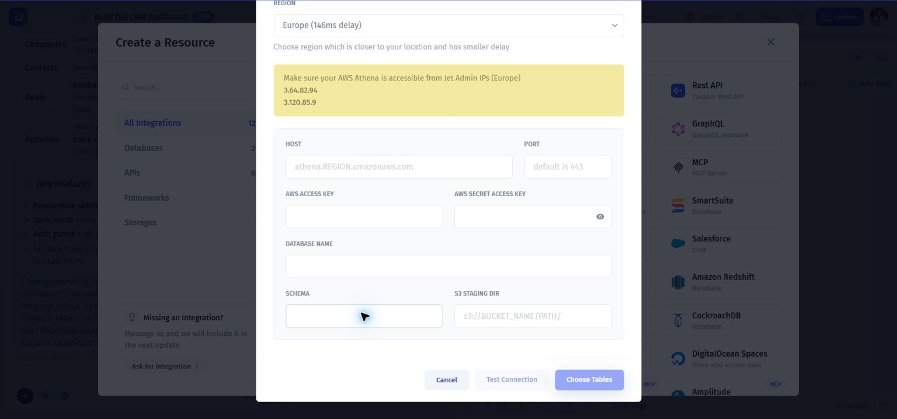

# Amazon Athena (AWS Athena)

Before connecting AWS Athena with Jet Admin, you need to have the following credential information:

* Host
* Port
* AWS access key
* AWS secret key
* Database name
* S3 staging dir

## Connect AWS Athena to Jetadmin

1. Click `Add Resource` from the data section on the left-side menu
2. Choose AWS Athena
3. Choose `Instant Connection` as a setup method
4. Type a unique resource name
5. Choose region which is closer to your location and has smaller delay
6. Fill in the Host, Port, AWS access key, AWS secret key, Database name, and S3 staging dir fields
7. Click `Choose Tables`
8. Choose the needed tables and click `Add Resource`

### &#x20;

Use the fields in your own connection form; the screenshot contains empty inputs or example placeholders.
