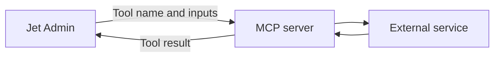

# MCP

Connect an MCP (Model Context Protocol) server to make its tools available in Jet Admin. A tool performs a defined operation, such as retrieving a record or creating a task.

## Set up and use a tool

1. [Connect an MCP server](connect-an-mcp-server.md).
2. [Test an MCP tool](test-an-mcp-tool.md) with known inputs.
3. [Use MCP tools in agents and workflows](use-mcp-tools-in-agents-and-workflows.md).
4. Review [authentication and server access](authentication-and-server-access.md) and [limitations and troubleshooting](limitations-and-troubleshooting.md).

For a worked example, see [Weather MCP example](using-mcp-server-tools-in-jetadmin-with-weather-mcp-via-smithery.md).

## Choose the right integration

MCP exposes tools. For database tables and business-app records, browse [Data Sources](../). For a custom HTTP request or SQL query, use [SQL queries and API requests](../../sql-queries-and-api-requests/).

Connecting an external MCP server to Jet Admin is separate from exposing a Jet Admin agent to another MCP client. For the latter, see [Using Agents with MCP Clients](../../../ai-agents/slack-telegram-email-and-mcp/using-agents-with-mcp-clients.md).
