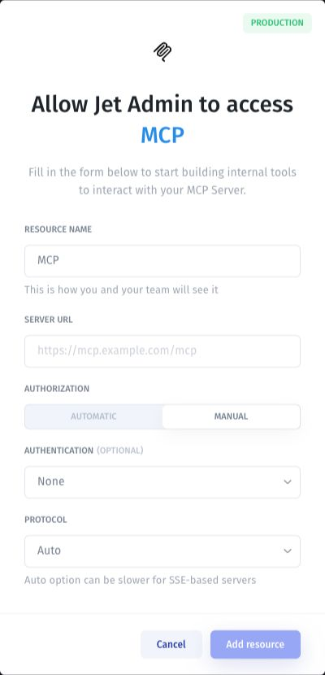

# MCP authentication and server access

Before connecting, confirm who operates the server, how Jet Admin can reach it, and what the connected account is allowed to do.

## Hosting and reachability

A provider-managed server is operated by another service. A self-managed server is deployed and maintained by your team. Hosting ownership is separate from network access: a self-managed server may have a public endpoint, while a provider-managed server may require authentication.

For a server in a private network, confirm that your Jet Admin environment can reach the endpoint. Check firewall and network rules if the connection times out.

## Configure authentication

The MCP connection form offers **Automatic** and **Manual** authorization. Use Automatic for the server's sign-in flow when supported. Under Manual, choose the authentication method required by the server, such as **None**, **API Key**, **Basic Auth**, or **OAuth 2.0**, and configure its credentials in the connection form.

<figure><figcaption>
Configure the authentication required by your server. The example form is a setup view, not a connected server.
</figcaption></figure>

A reachable URL does not establish permission to use every tool. The server and connected account determine the tools and data available.

## Verify access

1. Connect the server using [Connect an MCP server](connect-an-mcp-server.md).
2. Inspect the exposed actions.
3. Test a read action with a known input.
4. If the app needs a write action, confirm its expected effect and test it on a disposable record.
5. Verify the result in the external service.

For failures, see [MCP limitations and troubleshooting](limitations-and-troubleshooting.md).
