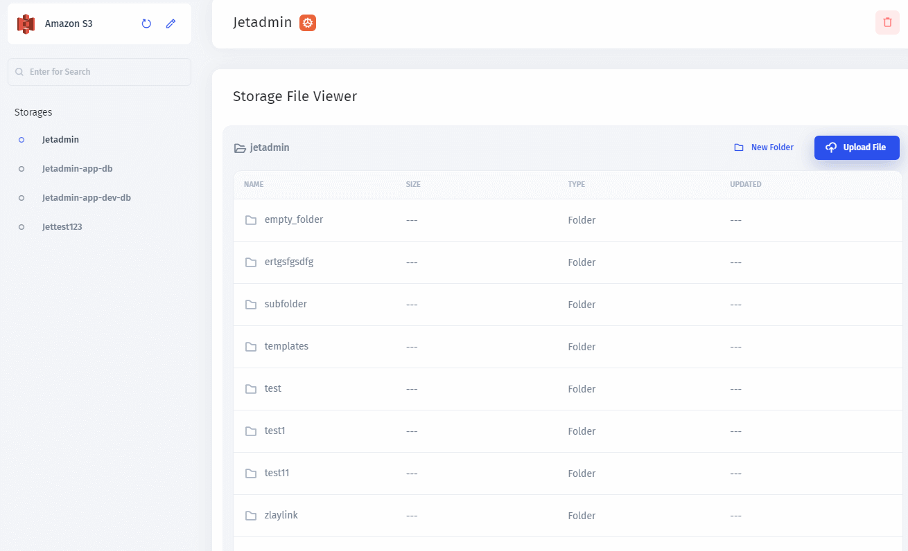

# Storages



Cloud Storage in Jet Admin allows you to integrate with the most popular providers so that you can manage your files and folders along with your internal tooling in one place. You will see a Storage File Viewer that you'll use to access your data.

We provide native integration with the following cloud storage solutions:


[amazon-s3.md](../integrations/amazon-s3.md)



[google-cloud-storage.md](../integrations/google-cloud-storage.md)



[firebase-cloud-storage.md](../integrations/firebase-cloud-storage.md)


