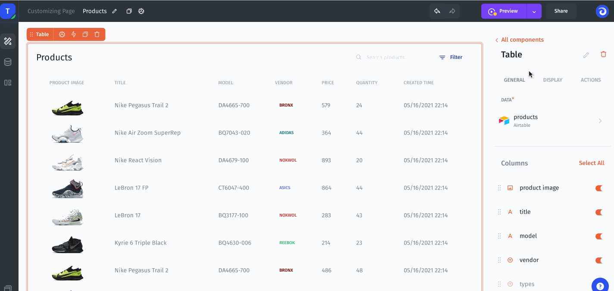
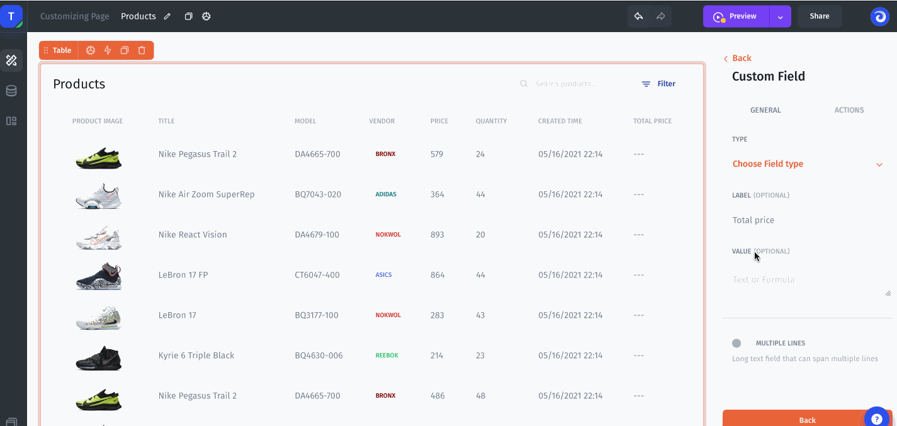
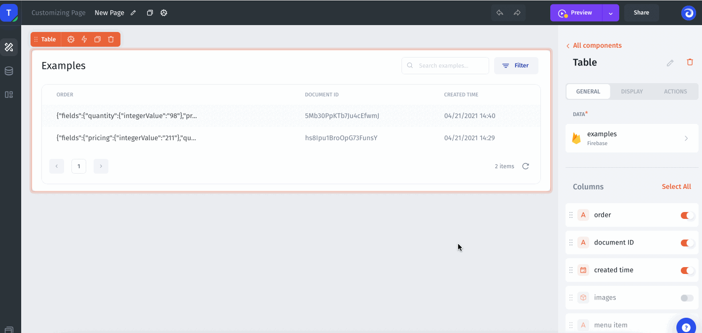
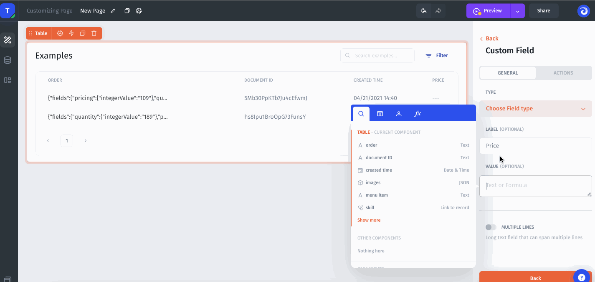

# Computed Columns

You can create custom columns in a table to handle cases such as math operations on your data, parsing JSON fields, or creating conditions. Let's look at a few examples of how to use it:

### Example 1: Use formulas over your data

In this use case we will create a custom column in the Customer table and calculate a score depends on some logical condition.

1\. Simply create a new Custom field in columns settings of table component.&#x20;


2\. Now we should configure Value for that Column using Formulas. We will use `IF` function to calculate Scores value, depending on Activities number for each customer:

`=IF(item.activities < 280, '50 points', IF(item.activities < 400, '70 points', '100 points'))`


### Example 2: Math operations over your data

Let's suppose you need to calculate the total cost by multiplying the Price and Quantity fields:\
\
1\. Simply create a new Custom field in columns settings of table component:



2\. Now we should configure Value for that Column. We will use \* operation to calculate Total cost value:

`=item.Price * item.Quantity`



3\. Now let's concatenate the Total cost with the currency $ using CONCAT() function:&#x20;

`=CONCAT("$", item.Price * item.Quantity)`


### Example 3: Parse JSON columns

Suppose you have a field that stores data in JSON format. You can display the desired data in a separate column. The JSON structure shown in the example:&#x20;

```javascript
{
  "fields": {
    "pricing": {
      "integerValue": "109"
    },
    "quantity": {
      "integerValue": "98"
    }
  }
}
```

1\. Simply create a new Custom field in columns settings of table component:



2\. Now let's display the Pricing value in a separate column. For the JSON structure shown in the example above, you need to use the following value:

`=item.order.fields.pricing.integerValue`



Now your data is displayed in a clear and readable way in a separate column.


Note that the value may differ depending on the JSON field structure.

