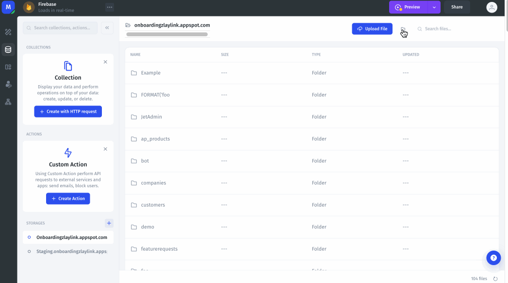

# Data Source Storage

### Upload files as an App Builder

In the menu on the left, go to the storages section and click on the storage to which you want to upload a file. Then, simply click on **Upload File** in the upper right corner, and choose the file you wish to upload.

<figure><figcaption></figcaption></figure>

### Add a storage as an App builder

To add a new storage to your resource, go to the storages section in the **Data Editor** menu, and click on the _Create Storage_ button. Then, you will need to configure the queries that suit your needs, only the _Upload_ query is required.

<figure><figcaption></figcaption></figure>

### Allow app users to upload files

You can allow your app users to upload files to your storage by using a **File Picker** form. Drag and drop it into your app, then set it up by choosing the Output Format **Save to Storage** and choosing the storage that you want to upload the file to.

 (4).png>)

