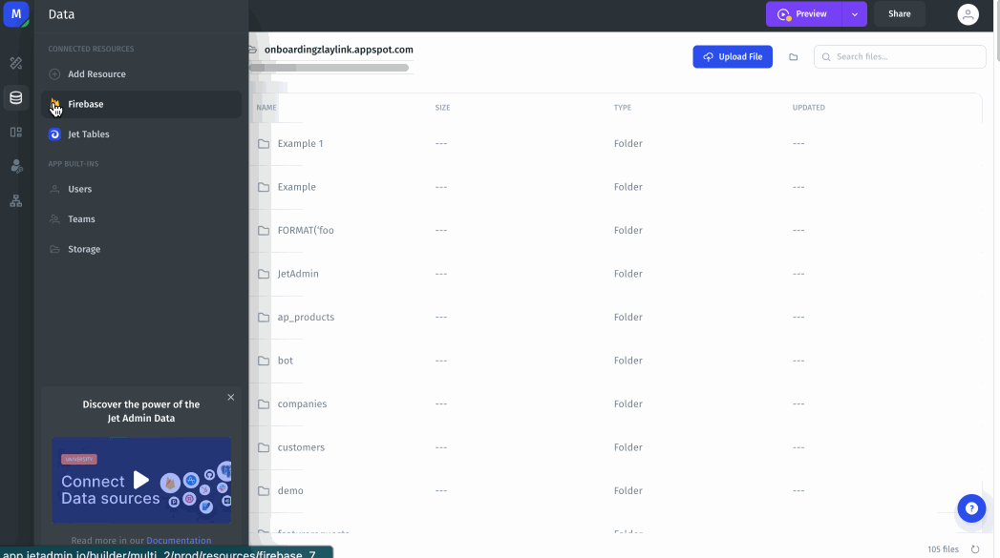
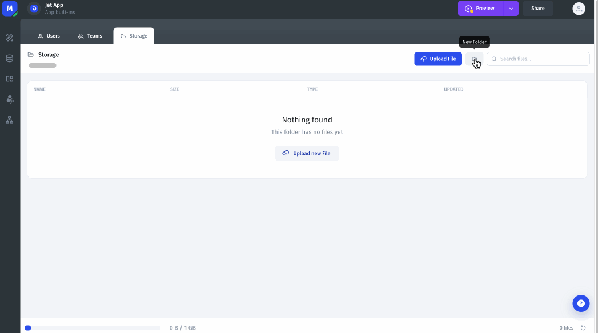

# Jet Admin Storage

Jet Admin gives you up to 20GB of storage allowance for all kinds of files, including images, videos, documents & pdfs.&#x20;

### Accessing Jet Admin Storage

You can easily access Jet Storage in the Data Menu on the left of the App builder interface.

<figure><figcaption></figcaption></figure>

### Uploading files and creating folders in Jet Admin Storage

When you are viewing your Jet Storage, you can create new folders or upload files by clicking on the _New Folder_ or _Upload File_ buttons at the top of the screen.

<figure><figcaption></figcaption></figure>

&#x20;
