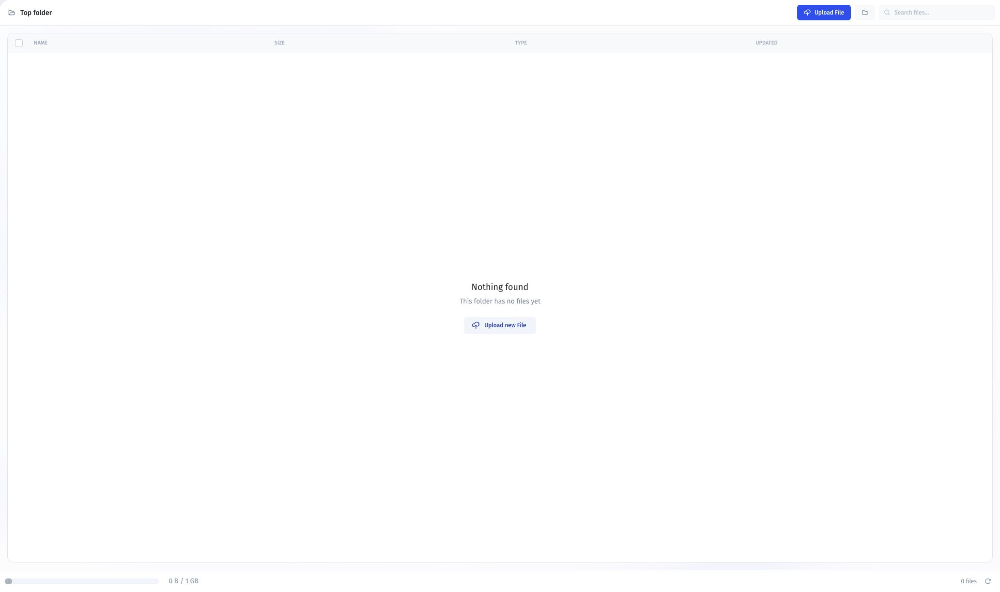

# Upload and manage files

Use the Data Editor to access files in Jet Admin Storage or a connected storage provider.

## Before you start

Use [Jet Admin Storage](file-storage-and-uploading/jet-admin-storage.md), or [connect an external provider](cloud-storage.md). Some providers require additional setup before Jet Admin can access their files; follow the provider's connection guide.

## Upload a file

<figure><figcaption>
Before uploading, open the intended storage and select Upload File. This is the empty-folder state.
</figcaption></figure>

1. Open the **Data Editor** and find the storages section.
2. Select the storage where you want to upload the file.
3. Select **Upload File** and choose a file.
4. Check that the uploaded file appears in the selected storage.

For Jet Admin Storage, you can also select **New Folder** to organize files. See [Jet Admin Storage](file-storage-and-uploading/jet-admin-storage.md) for the walkthrough.

## Let app users upload files

For the Classic App Builder, use a File Picker with **Save to Storage** as its output format. Follow [Configure resource storage and app uploads](file-storage-and-uploading/data-source-storage.md) to select the destination storage.

## Verify the upload

Open the uploaded file from the selected storage and confirm its name and contents. For an app upload, reload the app and check that the saved file remains accessible with the intended user permissions.

If the upload fails, check the destination storage configuration, the provider's access permissions, and any returned error. If a file uploads but does not appear in the app, check the value saved by the form and the component using it.

## Storage walkthrough



